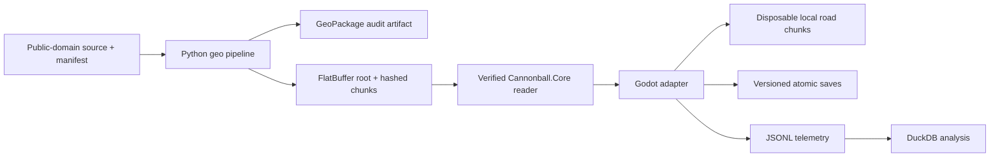

# Technical stack and implementation boundaries

For the decision history, see [architecture decision records](decisions/README.md).
For current delivery readiness and blockers, see the
[agentic-readiness audit](audits/2026-07-14-agentic-readiness.md) and
[delivery ledger](DELIVERY_LEDGER.json). Unresolved choices live in
[OPEN_QUESTIONS.md](OPEN_QUESTIONS.md).
The [agentic Godot automation research](research/2026-07-14-godot-agentic-automation.md)
defines the official-engine CLI, modern PlayGodot, and Computer Use strategy.
The [4.7.1 migration audit](audits/2026-07-14-godot-4-7-1-migration.md)
records the rebaseline evidence and renderer-backed capture constraint.

## Decision

Cannonball-Vibe uses an open-source-first stack built around Godot 4.7.1 .NET.
The game targets C# 12 and .NET 8 while the repository pins the available .NET
10.0.102 SDK. Forward+ is the shipping renderer, Godot Jolt is the default
physics backend, and the physics loop runs at 120 Hz.

The engine recommendation in GDD 0.1 is superseded for the prototype by this
decision. The route graph and run state remain portable so another renderer or
engine could consume them without rewriting game rules or content.

## Architecture

`Cannonball.Core` owns the authoritative route position, run/economy state,
deterministic random streams, save contracts, telemetry contracts, and route
content loader. It has no Godot dependency. The Godot project owns input,
rigid-body physics, rendering, generated collision, and the conversion between
authoritative route coordinates and the current local world.

## Implemented M0/P0 slice

- Custom `RigidBody3D` vehicle with four suspension raycasts, spring/damper
  forces, tire lateral grip, speed-sensitive steering, yaw stabilization,
  downforce, drag, braking, CCD, keyboard, and controller input.
- Schema-v3 FlatBuffer root plus independently hashed and sized `CBCK` route
  chunks, with real projected centerline, elevation, curvature, and grade
  samples. The procedural `RoadMath` corridor has been removed.
- Manifest-driven asynchronous file verification with a 112-second horizon,
  2–10 km visual lookahead, 500 m retention behind, a separate 2 km collision
  window, measured main-thread mesh construction, and vector local-origin
  rebasing.
- `MultiMesh` lane markings and roadside placeholders.
- Route-position DTO: edge ID, distance, lane, lateral offset, heading offset.
- Versioned System.Text.Json suspend saves with content checksum and atomic file
  replacement.
- JSONL telemetry events for pace, streaming state, suspend, and smoke tests.
- Headless autopilot smoke mode using a locked official NHPN/3DEP fixture. The
  integration fixture emits four 100 m chunks so the scenario exercises both
  initial loading and asynchronous streaming.

## Route content

The offline pipeline uses Python 3.13+, `uv`, GeoPandas, Shapely, Pyogrio/GDAL,
PROJ, Rasterio, NetworkX, and pytest. GeoPackage is the inspectable intermediate
format; FlatBuffers is the runtime contract. Runtime roots, metadata, chunks,
and normalized audit artifacts are immutable and content-addressed. An atomic
`current-package.json` pointer is the publication commit point, so interrupted
or concurrent builds cannot expose a mixed package.

Only sources with `license_status: public_domain`, an ISO acquisition date,
license evidence URL, and a matching SHA-256 are accepted. The pipeline rejects
OpenStreetMap-derived ancestry. The approved starting sources are:

- USDOT National Highway Planning Network for topology and route families.
- USGS 3DEP for elevation.

NHPN is not lane geometry. Its nominal source scale and possible horizontal
error require spline reconstruction, validation, and authored interchange
overrides before a route becomes drivable content.

Generated continental packages belong in release/CI artifacts, not Git. Source
art, audio, and binary models use Git LFS.

Exact retained source artifacts use immutable GitHub Releases as their required
store. Their recorded upstream URLs, exact checksums, and recursive manifests
support deterministic reacquisition. An independent AWS S3 Object Lock replica
and optional read-only Vercel health plane are deferred until the activation
threshold in
[ADR-0010](decisions/ADR-0010-defer-independent-source-replica.md) is met; the
implementation design remains documented in
[ADR-0009](decisions/ADR-0009-s3-object-lock-recovery-replica.md).

## Determinism contract

Stable seeds govern route content, events, macro traffic, scoring, and
reconstruction. The project does not promise bit-identical Jolt rigid-body
physics between operating systems. Saves therefore preserve both authoritative
route state and a small local vehicle state, then validate against a content
version and checksum.

## Validation gates

| Gate | Evidence |
| --- | --- |
| P0 feel | 25-mile road, 200 mph handling target, three assist profiles, 30-minute human sessions |
| P1 stream | 100–500 miles, no gaps/stalls/precision drift, bounded memory, save/resume |
| P2 continent | Bot and human complete all supported coast-to-coast paths |
| P3 decisions | Traffic, fuel, wear, stops, and route choices change player pace |
| P4 pressure | Enforcement and three materially distinct builds complete runs |

Current automation covers core contracts, source-policy enforcement,
transactional package publication, root/chunk budgets and hashes, malformed
chunk rejection, deterministic seam samples, runtime serialization, and a
short official-source Godot scene smoke. The 100-mile command repeats verified
transport of the 0.226102-mile fixture and reports that limitation explicitly;
representative long-route, local-origin, memory, and wheel validation remain
human or M1 gates.

## Input and platform plan

Keyboard and standard controller paths are active. Input actions use a 0.12
deadzone and separate trigger axes. M1 must add an in-game calibration screen
and validate one common force-feedback-capable wheel on Windows; force feedback
itself is outside the MVP unless testing justifies it.

CI runs the complete M0 gate on Linux and Windows: exact-tool doctor, core build
and tests, geodata lint and tests, and the official-engine headless Godot smoke.
Each runner uploads structured results and logs even after failure. A separate
scheduled Windows workflow runs a high-speed packaged short-corridor soak. It
does not replace the open 200 mph plus local-origin-rebase long-route gate.

## Agent automation

The project uses the official Godot editor and a project-owned C# scenario
runner. The custom Godot automation fork and legacy PlayGodot debugger transport
are retired; the PlayGodot concept remains the selected modernization path when
rendered UI needs a stable semantic scene-node API. Pure logic uses xUnit,
content tooling uses pytest, scene and physics behavior uses headless Godot
scenarios, and deterministic frame capture supplies visual artifacts. Computer
Use may exercise actual editor or packaged-game windows as a black-box visual
layer, but deterministic CLI evidence remains authoritative.

A modern PlayGodot implementation must be a debug-only addon on the official
engine, with loopback-only authenticated transport, a versioned protocol,
stable automation IDs, allowlisted mutation, transcripts, and no release-export
surface. MCP editor bridges or an MCP adapter over PlayGodot are optional
experiments. They must not become required infrastructure without an ADR
demonstrating exact-version support, security, transactional behavior,
auditability, and unique value beyond the existing tools.

## Asset and observability stack

Blender exports glTF/GLB assets. Far scenery and future far traffic use
`MultiMesh`; only near traffic receives physics bodies. Telemetry is append-only
JSONL so playtests can be analyzed directly with DuckDB and Python without
adding an online service dependency.
