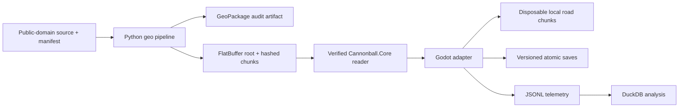

# Technical stack and implementation boundaries

For the decision history, see [architecture decision records](decisions/README.md).
For current delivery readiness and blockers, see the
[agentic-readiness audit](audits/2026-07-14-agentic-readiness.md) and
[delivery ledger](DELIVERY_LEDGER.json). Unresolved choices live in
[OPEN_QUESTIONS.md](OPEN_QUESTIONS.md).
The [agentic Godot automation research](research/2026-07-14-godot-agentic-automation.md)
defines the official-engine CLI, modern PlayGodot, and Computer Use strategy.
The [4.7.1 migration audit](audits/2026-07-14-godot-4-7-1-migration.md)
records the rebaseline evidence and renderer-backed capture constraint.

## Decision

Cannonball-Vibe uses an open-source-first stack built around Godot 4.7.1 .NET.
The game targets C# 12 and .NET 8 while the repository pins the available .NET
10.0.102 SDK. Forward+ is the shipping renderer, Godot Jolt is the default
physics backend, and the physics loop runs at 120 Hz.

The engine recommendation in GDD 0.1 is superseded for the prototype by this
decision. The route graph and run state remain portable so another renderer or
engine could consume them without rewriting game rules or content.

## Architecture

`Cannonball.Core` owns the authoritative route position, run/economy state,
deterministic random streams, save contracts, telemetry contracts, and route
content loader. It has no Godot dependency. The Godot project owns input,
rigid-body physics, rendering, generated collision, and the conversion between
authoritative route coordinates and the current local world.

## Implemented M0/P0 slice

- Custom `RigidBody3D` vehicle with four suspension raycasts, spring/damper
  forces, tire lateral grip, speed-sensitive steering, yaw stabilization,
  downforce, drag, braking, CCD, keyboard, and controller input.
- Schema-v4 FlatBuffer root plus independently hashed and sized `CBCK` route
  chunks, with real projected centerline, elevation, curvature, grade, lane
  topology, route context, and simplified trip-map geometry. The procedural
  `RoadMath` corridor has been removed.
- Manifest-driven asynchronous file verification with a 112-second horizon,
  2–10 km visual lookahead, 500 m retention behind, a separate 2 km collision
  window, measured main-thread mesh construction, and vector local-origin
  rebasing.
- `MultiMesh` lane markings and roadside placeholders.
- Route-position DTO: edge ID, distance, stable lane ID with legacy index,
  lateral offset, and heading offset.
- Schema-v3 System.Text.Json suspend saves with a checksum over the exact root
  package plus every chunk hash, durable temporary-file replacement, previous
  save backup recovery, and runtime reconstruction of route, lane, plan,
  origin/rebase, stream windows, vehicle motion/orientation, elapsed time, and
  run systems.
- JSONL telemetry events for pace, streaming state, suspend, and smoke tests.
- Headless autopilot smoke mode using a locked official NHPN/3DEP fixture. The
  integration fixture emits four 100 m chunks so the scenario exercises both
  initial loading and asynchronous streaming.

## Route content

The offline pipeline uses Python 3.13+, `uv`, GeoPandas, Shapely, Pyogrio/GDAL,
PROJ, Rasterio, NetworkX, and pytest. GeoPackage is the inspectable intermediate
format; FlatBuffers is the runtime contract. Runtime roots, metadata, chunks,
and normalized audit artifacts are immutable and content-addressed. An atomic
`current-package.json` pointer is the publication commit point, so interrupted
or concurrent builds cannot expose a mixed package.

Only sources with `license_status: public_domain`, an ISO acquisition date,
license evidence URL, and a matching SHA-256 are accepted. The pipeline rejects
OpenStreetMap-derived ancestry. The approved starting sources are:

- USDOT National Highway Planning Network for topology and route families.
- USGS 3DEP for elevation.

NHPN is not lane geometry. Its nominal source scale and possible horizontal
error require spline reconstruction, validation, and authored interchange
overrides before a route becomes drivable content.

For multi-edge linear corridors, raw 3DEP samples are conditioned with a
deterministic nine-sample median and a corridor-wide 7 percent grade projection.
This removes localized surface-model and structure spikes while retaining the
locked raster as provenance and keeping shared edge elevations identical.
Branched graphs keep raw elevations only when every grade already satisfies the
ceiling; otherwise the build fails until branch-aware vertical reconstruction is
available.

[ADR-0011](decisions/ADR-0011-lane-topology-route-context-and-trip-map.md)
defines the M2/M3 route semantics. Schema 5 implements ordered distance-bounded
lane sections inside stable route edges and explicit lane-to-lane junction
connectors for continuations, merges, splits, exits, entrances, and highway
transfers. It rejects incomplete section coverage, orphan lanes, crossing or
ambiguous successors, and connector movements not allowed by their source lane.
Versioned semantic records carry route identities and concurrency, exit numbers
and destinations, services, milepoint anchors, roadside markers, and source,
derived, or authored-override ancestry through the Python-to-C# package
boundary. Schemas 1–3 synthesize deterministic legacy lane IDs; saves map by a
stable lane ID when present and otherwise by the legacy lane index, failing with
an actionable compatibility error when neither mapping is possible.

The current NHPN pipeline deliberately emits conservative two-lane graybox
sections, shoulders, and index-preserving connectors as `derived` records. They
are not observed lane geometry. Source route hints and BEGMP/ENDMP values become
route identities and milepoint records with source provenance; named exits and
corrected lane topology require the checksum-locked source or deterministic
authored-overlay process tracked by Q-017.

Godot road generation derives variable width, markings, shoulders, gore areas,
barriers, collision, signs, and standardized interchange geometry from that
contract. `Cannonball.Core` exposes a trip-map projection over content-addressed
simplified immutable graph geometry and authoritative run state. Schema 5
carries LODs 0–2 per edge, validates the cross-language content hash, and
enforces a 16 MB simplified-map payload budget in addition to the 64 MB root
budget. The projector indexes semantic lookups and chooses the most detailed
common route LOD that fits a 20,000-point default draw budget; connected Godot
paths are batched across edge boundaries. Stable node and edge associations
keep the continental map independent of streamed road meshes.

The Godot full-screen map shows traveled and planned paths, progress,
alternatives, stops, exits, and transfers without depending on streamed scene
geometry. Its data-driven 1:1, fixed-ratio, and selective-cruise estimate inputs
change ETA only; edge-plus-distance position and real route distance remain
authoritative. Roadside mile-marker values remain distinct from total trip
progress. Q-001 still owns the commercial run-mode decision.

Generated continental packages belong in release/CI artifacts, not Git. Source
art, audio, and binary models use Git LFS.

Exact retained source artifacts use immutable GitHub Releases as their required
store. Their recorded upstream URLs, exact checksums, and recursive manifests
support deterministic reacquisition. An independent AWS S3 Object Lock replica
and its read-only Vercel health plane are deferred until the activation
threshold in
[ADR-0010](decisions/ADR-0010-defer-independent-source-replica.md) is met; the
implementation design remains documented in
[ADR-0009](decisions/ADR-0009-s3-object-lock-recovery-replica.md).

## Determinism contract

Stable seeds govern route content, events, macro traffic, scoring, and
reconstruction. The project does not promise bit-identical Jolt rigid-body
physics between operating systems. Saves therefore preserve both authoritative
route state and a small local vehicle state, then validate against a content
version and checksum.

## Validation gates

| Gate | Evidence |
| --- | --- |
| P0 feel | 25-mile road, 200 mph handling target, three assist profiles, 30-minute human sessions |
| P1 stream | 100–500 miles, no gaps/stalls/precision drift, bounded memory, save/resume |
| P2 continent | Bot and human complete all supported coast-to-coast paths |
| P3 decisions | Traffic, fuel, wear, stops, route choices, and the full-screen trip map change player pace while keeping progress understandable |
| P4 pressure | Enforcement and three materially distinct builds complete runs |

Current automation covers core contracts, source-policy enforcement,
transactional package publication, root/chunk budgets and hashes, malformed
chunk rejection, deterministic seam samples, runtime serialization, and a
short official-source Godot scene smoke. The 100-mile command repeats verified
transport of the 0.226102-mile fixture and reports that limitation explicitly;
P0-006 separately generates a checksum-bound authored automation corridor and
sweeps 500 actual route miles through the Godot streamer on Linux and Windows.
It reports route transitions, seams, rebases, local-coordinate bounds, frame
and build percentiles, working-set growth, collision residency, chunk hashes,
and exact resume comparisons for all three assist profiles. That synthetic
distance gate is not a claim of observed geography or a substitute for the
30-minute human handling sessions.

## Input and platform plan

Keyboard and standard controller paths are active. Input actions use a 0.12
deadzone and separate trigger axes. M1 must add an in-game calibration screen
and validate one common force-feedback-capable wheel on Windows; force feedback
itself is outside the MVP unless testing justifies it.

CI runs the complete M0 gate on Linux and Windows: exact-tool doctor, core build
and tests, geodata lint and tests, and the official-engine headless Godot smoke.
Each runner uploads structured results and logs even after failure. A separate
scheduled Windows workflow runs a high-speed packaged short-corridor soak. The
required CI matrix also runs the deterministic distance-complete 500-mile
scenario on Linux and Windows; high-speed feel remains covered by its separate
physics and human handling gates.

## Agent automation

The project uses the official Godot editor and a project-owned C# scenario
runner. The custom Godot automation fork and legacy PlayGodot debugger transport
are retired. The modern PlayGodot addon is required for interactive rendered UI
that needs a stable semantic scene-node API. Pure logic uses xUnit,
content tooling uses pytest, scene and physics behavior uses headless Godot
scenarios, and deterministic frame capture supplies visual artifacts. Computer
Use may exercise actual editor or packaged-game windows as a black-box visual
layer, but deterministic CLI evidence remains authoritative.

A modern PlayGodot implementation is a debug-only addon on the official
engine, with loopback-only authenticated transport, a versioned protocol,
stable automation IDs, allowlisted mutation, transcripts, and no release-export
surface. Its 2026-07-19 driver-menu comparison exposed focus and normalized
state that the macOS accessibility tree did not expose, activating ADR-0008.
MCP editor bridges or an MCP adapter over PlayGodot are optional
experiments. They must not become required infrastructure without an ADR
demonstrating exact-version support, security, transactional behavior,
auditability, and unique value beyond the existing tools.

## Asset and observability stack

[ADR-0012](decisions/ADR-0012-agentic-visual-asset-pipeline.md) defines the
production visual pipeline. Pinned Blender 5.1.2 command-line scripts lint original
source art and export glTF 2.0 binary assets; official Godot 4.7.1 command-line
imports then instantiate project-owned wrapper scenes and validate stable
semantic nodes, scale, axes, transforms, LODs, collision proxies, materials,
textures, and performance budgets. Machine-readable manifests recursively
record hashes, authorship, licensing, transformations, and export profiles.
Binary source art and models use Git LFS, while generated imports remain
replaceable.

The hero vehicle's visual rig follows the existing custom raycast simulation
through stable chassis, wheel, suspension, camera, light, damage, and material
anchors. It does not replace authoritative physics. Highway art is a modular
kit consumed by semantic procedural road generation; it does not encode lane or
navigation topology in monolithic meshes. Regional environments use
deterministic near-road placement, streamed midground, and low-cost distant
terrain or skyline tiers. Graybox implementations keep the same contracts so
normal headless delivery does not require production art.

P1-008 now exercises that boundary with the project-original procedural Hero
GT: checksum-locked Blender source, a deterministic GLB, a project-owned C# rig
adapter, an official-importer scene normalized to remove only non-semantic node
IDs, three declared LODs, explicit collision and damage anchors, chase and
cockpit cameras, and a selectable graybox fallback. The GLB remains a build
artifact; releases ship the checked deterministic generated scene. Release
exports keep native text scenes instead of reserializing them to cache-specific
binary scene IDs, preserving auditable and reproducible PCK bytes. Its
technical baseline is documented in
[the 2026-07-18 review](audits/2026-07-18-p1-008-hero-gt-technical-review.md);
Q-020 still owns final art direction and exact rights approval.

P1-009 now exercises the same boundary for highway visuals. The procedural road
generator consumes one shared `RoadVisualKit` with production and graybox
profiles, semantic metadata, 18 shared materials, nine shared meshes, and
reusable instances for markings, reflectors, barriers, guardrails, posts, route
shields, exit-only panels, service panels, bridge decks, girders, piers, and
abutments. Grade-separated fixture crossings produce stable structure
placements from upper/lower edge geometry instead of edge-name rendering
special cases. The structure stays aligned through local-origin rebases and
keeps its visual assembly separate from the authoritative road collision.
Its deterministic road-visual scenario traverses every route-context waypoint,
then revisits the generated bridge/overpass at its exact route distance for
daylight and night renderer stages. The aggregate verifier also runs the
variable-lane/gore topology and all representative interchange route choices.
The current standards research and explicit non-compliance boundary are
recorded in
[the modern highway visual baseline](research/2026-07-18-modern-highway-visual-standards.md).
Q-024 owns the final visual language; Q-022 still owns renderer and target-PC
budgets.

[ADR-0014](decisions/ADR-0014-directed-carriageways-and-road-markings.md)
defines traffic direction at the route boundary. Route schema 5 keeps every edge
single-directional and explicitly distinguishes reciprocal divided-highway
carriageways from unpaired ramps, true one-way roads, and unclassified source
records. Reciprocal pairs share a stable group ID and fail validation when
missing or asymmetric. The renderer follows the same contract with a yellow
left/median edge, white same-direction lane and right-edge markings, and white
right-side channelization. Future opposing traffic uses the validated paired
edge; it is never inferred from a nearby spline.

Far scenery and future far traffic use `MultiMesh`; only near traffic receives
physics bodies. Deterministic renderer contact sheets and driving captures
supplement quantitative asset gates. Computer Use may inspect the real editor
or packaged result as a black-box visual check, while PlayGodot remains scoped
to semantic rendered-UI automation rather than 3D asset promotion. Telemetry is
append-only JSONL so playtests can be analyzed directly with DuckDB and Python
without adding an online service dependency.
