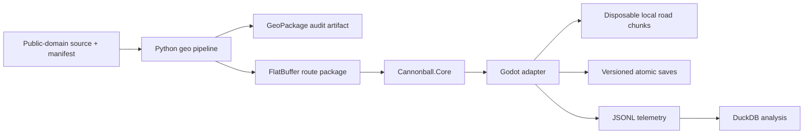

# Technical stack and implementation boundaries

For the decision history, see [architecture decision records](decisions/README.md).
For current delivery readiness and blockers, see the
[agentic-readiness audit](audits/2026-07-14-agentic-readiness.md) and
[delivery ledger](DELIVERY_LEDGER.json). Unresolved choices live in
[OPEN_QUESTIONS.md](OPEN_QUESTIONS.md).

## Decision

Cannonball-Vibe uses an open-source-first stack built around Godot 4.6.3 .NET.
The game targets C# 12 and .NET 8 while the repository pins the available .NET
10.0.102 SDK. Forward+ is the shipping renderer, Godot Jolt is the default
physics backend, and the physics loop runs at 120 Hz.

The engine recommendation in GDD 0.1 is superseded for the prototype by this
decision. The route graph and run state remain portable so another renderer or
engine could consume them without rewriting game rules or content.

## Architecture

`Cannonball.Core` owns the authoritative route position, run/economy state,
deterministic random streams, save contracts, telemetry contracts, and route
content loader. It has no Godot dependency. The Godot project owns input,
rigid-body physics, rendering, generated collision, and the conversion between
authoritative route coordinates and the current local world.

## Implemented M0/P0 slice

- Custom `RigidBody3D` vehicle with four suspension raycasts, spring/damper
  forces, tire lateral grip, speed-sensitive steering, yaw stabilization,
  downforce, drag, braking, CCD, keyboard, and controller input.
- Procedural 25-mile road split into deterministic 2 km chunks.
- Time-to-arrival prefetch with a 112-second horizon, 2–10 km lookahead,
  500 m retention behind, one chunk constructed per frame, and 1 km
  local-origin rebasing.
- `MultiMesh` lane markings and roadside placeholders.
- Route-position DTO: edge ID, distance, lane, lateral offset, heading offset.
- Versioned System.Text.Json suspend saves with content checksum and atomic file
  replacement.
- JSONL telemetry events for pace, streaming state, suspend, and smoke tests.
- Headless autopilot smoke mode.

The 2 km active-physics-ahead budget is defined, but M0 road chunks currently
carry collision across the full visual window. Separating visual-only and
collision chunks is an M1 profiling task.

## Route content

The offline pipeline uses Python 3.13+, `uv`, GeoPandas, Shapely, Pyogrio/GDAL,
PROJ, Rasterio, NetworkX, and pytest. GeoPackage is the inspectable intermediate
format; FlatBuffers is the runtime contract.

Only sources with `license_status: public_domain`, an ISO acquisition date,
license evidence URL, and a matching SHA-256 are accepted. The pipeline rejects
OpenStreetMap-derived ancestry. The approved starting sources are:

- USDOT National Highway Planning Network for topology and route families.
- USGS 3DEP for elevation.

NHPN is not lane geometry. Its nominal source scale and possible horizontal
error require spline reconstruction, validation, and authored interchange
overrides before a route becomes drivable content.

Generated continental packages belong in release/CI artifacts, not Git. Source
art, audio, and binary models use Git LFS.

## Determinism contract

Stable seeds govern route content, events, macro traffic, scoring, and
reconstruction. The project does not promise bit-identical Jolt rigid-body
physics between operating systems. Saves therefore preserve both authoritative
route state and a small local vehicle state, then validate against a content
version and checksum.

## Validation gates

| Gate | Evidence |
| --- | --- |
| P0 feel | 25-mile road, 200 mph handling target, three assist profiles, 30-minute human sessions |
| P1 stream | 100–500 miles, no gaps/stalls/precision drift, bounded memory, save/resume |
| P2 continent | Bot and human complete all supported coast-to-coast paths |
| P3 decisions | Traffic, fuel, wear, stops, and route choices change player pace |
| P4 pressure | Enforcement and three materially distinct builds complete runs |

Current automation covers core contracts, source-policy enforcement, pipeline
determinism, runtime serialization, and a short Godot scene smoke. Long-duration
stress and wheel validation are M1 gates.

## Input and platform plan

Keyboard and standard controller paths are active. Input actions use a 0.12
deadzone and separate trigger axes. M1 must add an in-game calibration screen
and validate one common force-feedback-capable wheel on Windows; force feedback
itself is outside the MVP unless testing justifies it.

CI runs core tests on Linux and Windows, the geodata suite on Linux, and a
headless Godot smoke on Linux. A scheduled Windows Godot workflow establishes
the second-platform runner before M1 stress testing.

## Asset and observability stack

Blender exports glTF/GLB assets. Far scenery and future far traffic use
`MultiMesh`; only near traffic receives physics bodies. Telemetry is append-only
JSONL so playtests can be analyzed directly with DuckDB and Python without
adding an online service dependency.
