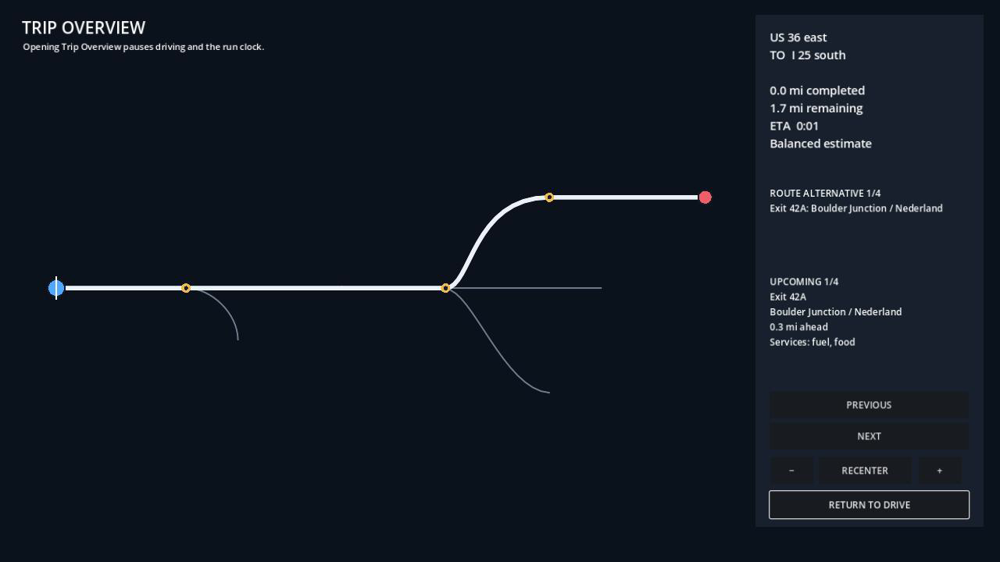

# P0-013 trip-map implementation review

## Outcome

The machine-verifiable portion of P0-013 is implemented and passes locally on
the official Godot 4.7.1 .NET editor. The task remains `in_progress` because
the delivery contract requires a human comprehension and accessibility review.

## Implemented contract

- `Cannonball.Core` projects authoritative edge-plus-distance run state onto
  immutable content-addressed map geometry. It does not read chunks, scene
  transforms, or streamed nodes.
- The projection separates traveled, planned, and alternative paths and emits
  start, destination, current position, exits, highway transfers, services,
  completed distance, remaining distance, and assist-aware ETA.
- The Godot overlay supports keyboard and controller open/close, bounded pan,
  bounded zoom, recenter, alternative and feature inspection, stable
  automation IDs, focusable controls, scalable text, and width/marker cues
  that do not rely on color alone.
- Opening Trip Overview pauses local driving and excludes the paused interval
  from the authoritative saved run clock, matching Q-019's solo-mode default.
- The representative interchange fixture now derives deterministic map LODs
  from the same authoritative route samples used to build its road chunks.
- The PlayGodot live harness mounts the production `Main.tscn`, so menu and map
  checks exercise the real runtime while the debug-only security boundary is
  preserved.

## Verification

- `DOTNET_ROLL_FORWARD=Major dotnet test Cannonball.sln --filter 'FullyQualifiedName~TripMap'`:
  3 passed.
- `./scripts/verify-trip-map.sh --automation auto`: passed, including the
  official-engine scenario, package-boundary checks, Ruff, and 16 PlayGodot
  tests.
- `./scripts/capture-scenario.sh /tmp/p0-013-trip-map.avi --trip-map-review`:
  360 frames at 60 FPS; SHA-256
  `a380895341a2d02cd3ccfad8338994e4cc4c39ef55174378778df6963eb47ba5`.
- `./scripts/check.sh`: passed with 75 C# tests, 78 map-pipeline tests, 12
  PlayGodot unit tests, and the official-engine smoke.
- Review image SHA-256:
  `ba6be730d63ef28d50192cee4c9f3ebc36a4de26e4639d4f3696940a0be8acee`.

## Adversarial review

The review checked graph authority, geometry clipping, branch ordering,
streaming independence, duplicate feature IDs, controller/keyboard input,
pause deadlocks, run-clock accounting, responsive map bounds, automation-ID
uniqueness, test-fixture isolation, and 720p layout. It found and corrected:

- representative interchange semantics omitted simplified map geometry;
- the original PlayGodot live scene tested a standalone HUD instead of Main;
- the first 720p layout allowed summary and selection text to overlap;
- wall-clock save accounting included time spent in the paused trip map;
- the production CanvasLayer initially obscured a generic PlayGodot crop
  fixture after the harness began mounting Main.

No unresolved machine-actionable finding remains. Continental-scale and
compression-mode evidence should remain part of the subsequent P0-013
closeout, alongside the required human review.

## Human gate

Review and answer Q-028 in
[the trip-map handoff](../QUESTIONS_FOR_RANDROID_2026-07-19_TRIP_MAP.md).
