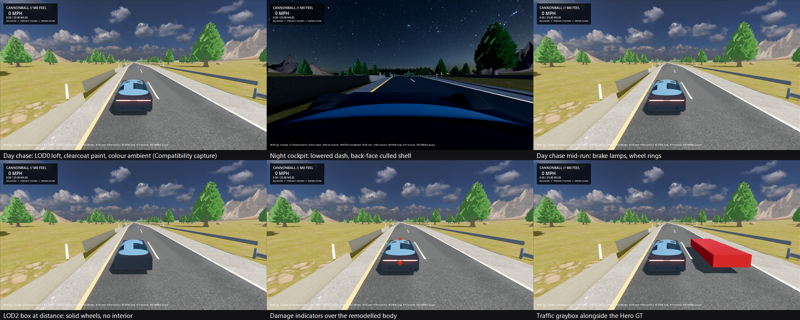

# P1-008 Hero GT remodel: lofted body, spoked wheels, cockpit, clear coat

- Date: 2026-09-02
- Task: P1-008 (stacked on P1-009 #109 and P1-010 #108)
- Code revision: branch `claude/p1-008-hero-gt-remodel-20260902`
- Platform: Windows 11 Pro 10.0.26200, RTX 3080 Ti; Godot
  `4.7.1.stable.mono.official.a13da4feb`; Blender `5.1.2` build `ec6e62d40fa9`
- Working choice: Q-020 Option A (project-original Hero GT), pending Q-040

## Outcome

The stacked-box Hero GT of 2026-07-18 is replaced by a second-generation
procedural model built by the same script path
(`tools/vehicles/create_hero_gt.py`) under the same contract: the same 37
semantic nodes, 2.84 m wheelbase, 1.64 m track, 0.34 m wheel radius, 0.62 m
suspension rest length, three LODs, a box collision proxy, no textures and
ten materials. Every gate the previous model passed still passes, and the
model now reads as a car rather than a block.

## What changed

- **Body.** Eleven cross-sections from nose to tail are lofted into a quad
  hull, Catmull-Clark subdivided twice, and cut with four cylindrical wheel
  arches (exact boolean) before the modifiers are applied. Faces are tagged
  by strip and section into three parts the cockpit camera can exclude:
  `LOD0_LowerBody`, `LOD0_Cabin` (windshield, side and rear glass) and
  `LOD0_RoofSpine` (roof panel). Sills, splitter, diffuser, grille, LED light
  bars in dark housings, mirrors on stalks and exhaust tips are separate
  bevelled parts.
- **Wheels.** Each wheel is a rounded tyre ring, an open rim barrel, five
  blade spokes, a hub, a brake disc and a red caliper, all under the
  `Wheel_*` pivots the rig rotates and steers. The tyre is a ring rather than
  a solid cylinder so the rim reads through it.
- **Cockpit.** `LOD0_Interior` carries the floor, dashboard, console, door
  cards and two seats; a torus steering wheel sits at the driver reference.
- **LODs.** LOD1 is a one-level subdivision of the same loft with static
  wheel silhouettes; LOD2 is the raw hull with eight-sided wheels. Triangle
  counts: LOD0 16,634, total 19,498 against budgets of 24,000 and 30,000.
- **Materials.** The paint declares a clear coat and the glass a tinted,
  blended surface in Blender. Godot's glTF importer drops the clear-coat
  extension and flattens the glass, so `VehicleVisualRig.PolishImportedMaterials`
  restores them by material name in the project-owned wrapper, which ADR-0012
  designates for material overrides. All materials are single-sided: the
  exporter writes `doubleSided` from Blender's backface flag, and a
  double-sided hull had blocked the cockpit camera.
- **Exporter.** The contact sheet now hides LOD1, LOD2 and the collision
  proxy explicitly (Blender's `hide_render` does not cascade from an empty),
  renders at 640x480 per view, and resolves its output paths absolutely so
  Blender's working directory cannot redirect them.
- **Gate.** `scripts/verify-vehicle-asset.sh` stages its isolated projects
  with tar where rsync is absent.
- **Lighting.** Every capture so far rendered shadow sides near black. Two
  causes: the preset ambient energies were written for the flat-colour sky
  and were too low for the HDRI-lit AgX scene (raised to Dawn 1.15, Day
  1.55, Overcast 1.45, Night 0.7), and the Compatibility renderer that the
  headless capture path uses contributes no measurable sky-sourced ambient
  at any energy. `SkyLighting` now picks the ambient source by renderer:
  sky radiance on Forward+, the preset ambient colour on Compatibility, and
  records the choice as `ambient_source` metadata on the environment. The
  two contract fields the scenarios assert (background colour, light energy)
  are unchanged.

## Verification

| Check | Result |
| --- | --- |
| `validate_and_export_hero_gt.py` | `CANNONBALL_HERO_GT_EXPORT_OK triangles=19498 lod0=16634 materials=10`; GLB SHA-256 identical across repeated exports |
| `pack_imported_scene.gd` then `validate_import.gd` | `CANNONBALL_HERO_GT_IMPORT_OK nodes=112 triangles=19498`, all 37 required nodes resolved |
| `validate_manifest.mjs` | `CANNONBALL_ASSET_MANIFEST_OK asset=hero-gt artifacts=9 nodes=37` |
| `run-scenario.sh --fixture representative-corridor --profile vehicle-visual` | all eight stages (daylight chase, night cockpit, braking, steering lock, suspension travel, LOD transitions, damage zones, graybox equivalence) |
| `dotnet test` | 145 passed |
| `capture-scenario.sh --vehicle-visual-review` (Compatibility, 480 frames) | review sheet above; barrier and body shadow sides now hold colour instead of black |

## Claims not made

- No human has approved the silhouette, cabin or materials; Q-020's art
  gate stays open and Q-040 asks whether the production vehicle stays
  procedural.
- The PCK audit stage of `verify-vehicle-asset.sh` was not run on this
  machine (no Mono export templates installed); the remaining stages were run
  individually as listed above.
- No frame-time claim; the reference matrix was not re-run.
