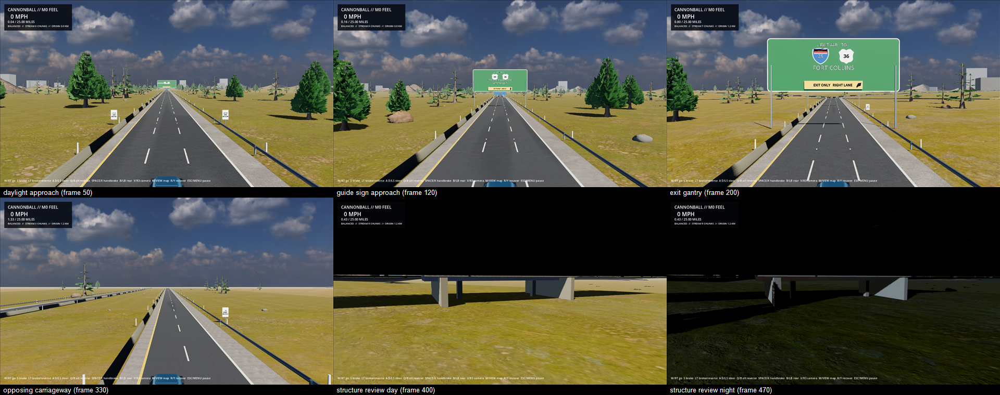

# P1-009 highway surfaces: sourced pavement, shoulders, barriers and guardrails

- Date: 2026-09-02
- Task: P1-009 (stacked on the P1-010 rendering foundation, PR #108)
- Code revision: branch `claude/p1-009-highway-kit-pbr-20260902`
- Platform: Windows 11 Pro 10.0.26200, RTX 3080 Ti; Godot
  `4.7.1.stable.mono.official.a13da4feb`
- Renderer for captures: Compatibility/OpenGL 3.3 via `capture-scenario.sh`

## Outcome

The road kit's flat pavement, shoulder and concrete colours became sourced,
provenanced PBR surfaces, and the box-section median barrier and guardrail
became FHWA-profile meshes, without changing lane geometry, markings, signs,
collision, streaming or any semantic node. The production road-visual profile
still resolves every count it did before, now reporting
`surfaces=sourced terrain=sourced`.

The review sheet (SHA-256
`17a81a73d31ae79e52be51757cb4dce3ca8d1ce86c1078a493e35e8bf7d0a0e3`) is six
frames from `capture-scenario.sh --road-visual-review` on the
representative-interchanges fixture at 1280x720: the daylight approach, a
guide-sign approach, the exit gantry, the opposing carriageway with its
barrier and guardrail, and the grade-separated structure by day and by
night. Compatibility renderer; no SSAO or glow.

## What changed

- **Pavement and shoulder.** `assets/environments/shaders/pavement.gdshader`
  samples the locked `clean_asphalt` (2K) and `asphalt_04` (1K) Poly Haven
  sets with metre UVs: U is lateral offset from the route centreline, V is
  route distance wrapped at 4,096 m per segment (`RoadChunk.BuildRibbonMesh`)
  so float32 stays precise across the continent. A second rotated sample scale
  mixed by a hash breaks the repeat, a long-narrow noise band darkens and
  smooths overlay patches, and the far field converges on the mean colour.
  Tile sizes (3.2 m and 25.6 m for the mainline, 2.56 m and 20.48 m for the
  shoulder) divide the wrap period so the wrap never shows.
- **Concrete and structures.** `furniture.gdshader` textures instanced meshes
  triplanar in *scaled* object space, recovering the per-instance stretch from
  `MODEL_MATRIX`, so one texture metre is one world metre on a 30 m barrier
  segment and a 1 m one alike. Barrier and guardrail instances carry their
  wrapped route midpoint in `INSTANCE_CUSTOM.x`, so the pattern runs
  continuously across segments; the bridge deck, girders, piers and abutments
  pick the surface up through the shared `Concrete` material. A grime term
  darkens the lower half of every barrier.
- **Profiles.** `RoadFurnitureMeshes.cs` builds a unit-length New Jersey /
  F-shape barrier (0.61 m base, 0.81 m tall, 55 and 84 degree faces) and a
  W-beam guardrail sheet (0.31 m tall, 0.083 m corrugation) that the existing
  segment transforms stretch and place unchanged; the graybox profile keeps
  the box meshes. Galvanised steel is a two-sided metallic material.
- **Ground.** The environment ground tiles moved to 8 m and 51.2 m so they
  also divide the wrap period.

Counts pinned by the contract are unchanged from PR #108 (19 shared
materials, 10 shared meshes, 11 retroreflective).

## Verification

| Check | Result |
| --- | --- |
| `run-scenario.sh --fixture representative-interchanges --profile road-visual` | `CANNONBALL_ROAD_VISUAL_OK` with 9 chunks, 626 reflectors, 199 barrier and 199 guardrail segments, 3 guide signs, 6 shields, 2 services, bridge deck and overpass resolved, `surfaces=sourced terrain=sourced`, max visual build 27.7 ms against the 50 ms budget |
| `capture-scenario.sh --road-visual-review` | daylight and night-retroreflective stages captured; frames in the review sheet |
| `dotnet test` | 145 passed |

## Claims not made

- No jurisdiction research (Q-024), sign typography, delineator or post
  detail changed; those remain P1-009 work.
- No human readability or rights approval; every sourced record is pending
  under Q-037 and the sourced directory stays out of release presets, where
  the kit falls back to its flat colours.
- No performance claim beyond the chunk build budget; the reference matrix
  was not re-run.
