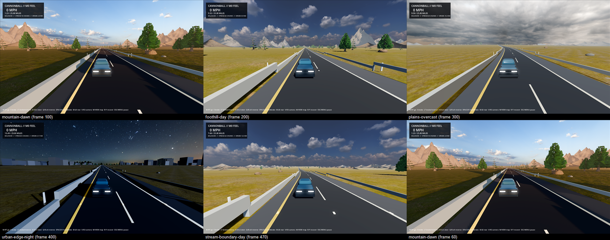

# P1-010 rendering foundation: sourced skies and ground, lighting presets, conifer asset

- Date: 2026-09-02
- Task: P1-010 (with narrow, recorded touches on P1-009 and P1-008 surfaces)
- Code revision: branch `claude/p1-010-rendering-foundation-20260901`, base
  `72e0e55` (main after PR #106); the PR head is recorded in the ledger entry
- Platform: Windows 11 Pro 10.0.26200, Ryzen 9 5900X, RTX 3080 Ti 12 GB
- Engine: Godot `4.7.1.stable.mono.official.a13da4feb`; Blender `5.1.2`
  build hash `ec6e62d40fa9`; Node 24.18.0; .NET SDK 10.0.102
- Session goal: raise every model toward a properly sourced or meticulously
  built, realistic, performant, at-least-AA standard

## Outcome

The environment slice moved from flat-coloured primitives to sourced,
provenanced art with a physically based lighting stack, without changing
route, collision, physics or save semantics. Every existing environment,
road-visual, vehicle-visual, integrated-slice and reference-performance
contract still resolves; the environment gate passes on all four quality
profiles; the new conifer passes a deterministic Blender-to-Godot gate.

The review sheet (SHA-256
`8360d4782a0c98967b843731283e5cff482a20c129b9ecc2e848f2048556c36a`) is six
frames from `capture-scenario.sh --environment-review` through the
Compatibility renderer at 1280x720: mountain dawn, foothill day, plains
overcast, urban-edge night, stream-boundary day, and an earlier mountain dawn
frame. Forward+ effects (SSAO, glow) are configured but not exercised by that
capture path.

## What was built

### Sourced art with recursive provenance

`tools/environments/sourced_assets.py` plans, acquires and verifies third-party
CC0 art against `data/assets/environments/sourced-assets.lock.json`. The lock
records, per asset, the provider, authors, publication date, canonical URL and
licence, and per file the download URL, provider-declared size and MD5, the
acquired SHA-256, acquisition timestamp and HTTP response headers. Sixteen
Poly Haven assets (four sky HDRIs at 2K, eleven 1K-2K PBR sets, one
photogrammetry boulder acquired for a later slice) total 61,301,680 bytes.
Runtime files are the acquired bytes; nothing is re-encoded. Every record is
`pending-human-review` and `assets/environments/sourced/` is excluded from
both release presets until Q-037 is answered.

### Lighting

`game/World/Environment/SkyLighting.cs` owns the directional light and world
environment for the whole runtime and is the single place the environment,
road-visual, vehicle-visual and reference-performance scenarios apply their
presets. Each preset carries the light colour, energy and rotation, the
contract background colour, ambient, fog, tonemap exposure, and a panorama
path. `tools/environments/analyze_skies.py` measured each HDRI's sun from its
brightest cluster (day azimuth 214.3 deg / elevation 47.9 deg, dawn 219.6 /
6.4, overcast 169.2 / 35.3, night moon 210.6 / 15.6) and wrote
`assets/environments/sky-presets.json`, so shadows fall away from the visible
sun. The graybox flag or a missing HDRI falls back to a procedural sky with
the same colours. Presets are idempotent: scenarios that re-apply every frame
do not rebuild the radiance map.

### Ground and landforms

`assets/environments/shaders/ground.gdshader` blends grass, dry grass, dirt
and rock by per-vertex route weights (`RegionalTerrainRibbon.GroundWeights`)
and by slope, samples each albedo at two scales mixed by a hash so the repeat
is not readable from the car, and converges on each layer's mean colour in the
far field. UVs are metres; route distance wraps at 4,096 m on the CPU so
float32 coordinates stay precise across the continent. The road terrain
margin, junction seam quads and the 30 km backdrop plane share the surface.
`HeightfieldMeshes.cs` builds noise-displaced massifs and hills; the mountain
shader shades them by slope and altitude into rock, forest and snow with
object-space triplanar mapping, so instance scale alone turns one mesh into a
wooded hill or a snow-capped peak.

### Conifer

`tools/environments/create_conifer.py` builds a ponderosa-style pine in the
pinned Blender: a bark-mapped trunk with root flare, eleven whorls of bent
needle cards with baked sway weights in vertex alpha, three LODs (1,557 / 197
/ 4 triangles) and a two-card impostor, plus EEVEE-rendered needle albedo and
normal cards and an impostor card from procedurally modelled needle clusters.
The source is exported by `validate_and_export_environment_asset.py` against
`conifer.contract.json`, normalised by the existing `pack_imported_scene.gd`,
inventoried by `validate_generated_scene.gd`, and described by a schema-1
manifest. `scripts/verify-environment-asset.sh --asset conifer` runs two
exports and compares GLB bytes, rejects unapplied-scale, missing-node and
external-texture mutations, imports in an isolated project copy staged with
tar (rsync is absent on Windows), proves the tracked generated scene is
reproduced byte for byte, and validates the manifest.

### Streaming

Near-layer trees and rocks are placed per 150 m route cell with three LOD
MultiMeshes and per-cell visibility ranges (High: 170 / 520 / 1,500 m), so
LOD switches near the car rather than per 1.4 km chunk. Density follows the
region: dense stands in the mountains, thinning through the foothills, sparse
on the plains and urban edge. Mid and distant layers instance the heightfield
meshes; urban buildings receive per-instance tints.

## Verification

| Check | Result |
| --- | --- |
| `verify-environment-assets.sh --region representative --all-quality-levels` | pass; high 3,656 / balanced 1,880 / low 984 / graybox 536 terrain triangles, semantics equivalent, 5 stages, 4 regions, 49 observed chunks |
| environment-streaming High marker | `textures=sourced conifer=generated-scene sky=sourced-hdri max_build_ms=13.222` |
| `verify-environment-asset.sh --asset conifer` | pass; deterministic rebuilds 2, GLB SHA-256 `a60da930…3936f` identical across exports |
| `validate_manifest.mjs` for the conifer | pass, 10 artifacts, 11 semantic nodes |
| `dotnet test` | 145 passed |
| `sourced_assets.py verify` | 42 files, 61,301,680 bytes, all SHA-256 match |
| Cold `godot --import` of the new art | 51 s, 130 imported files, 111 MB cache |

## Defects found and fixed

- **Streamer stall on stationary review points (pre-existing on main).**
  Since the 2026-08-16 per-metre refresh gate, `RefreshDesiredChunks` ran only
  on travel or on a load completion, while it builds at most one collision
  body per call. A stationary position needing two collision chunks, which
  the environment review's urban-edge stage is, never got the second build,
  `IsStreamingSettled` stayed false and the profile failed at its 1,200-frame
  budget. Confirmed by running unmodified main in a throwaway worktree.
  The streamer now records a collision backlog and refreshes while one exists.
  `verify-environment-assets.sh` is not in any CI workflow, which is why it
  went unnoticed.
- **Disposed sky material.** The first `SkyLighting` disposed the freshly
  assigned `PanoramaSkyMaterial` wrapper inside its own scope and then set the
  panorama on it. Ownership now transfers to the sky and a fresh wrapper is
  fetched before any property is set.
- **Import cache staleness.** Editing a `.glb.import` in place did not
  re-import in the worktree; the generated scene tracked from that cache
  lacked the `gi_mode = 0` lines a fresh import writes. The gate's isolated
  import caught it; the tracked scene now comes from a fresh import.
- **Slope from raw vertex normals.** The terrain ribbons are double-sided with
  mixed winding, so the first ground shader saw downward normals and painted
  rock everywhere. Slope now uses the absolute normal.

## Environment constraints recorded

- Windows Smart App Control blocks every newly written unsigned binary on the
  reference PC (Code Integrity events 3077/3118). A fresh worktree venv cannot
  load `pyogrio`, and uv regenerating the shared venv's `cannonball-map.exe`
  produced a blocked launcher. `python -m cannonball_map` now replaces the
  launcher in the two scenario scripts; see Q-039.
- Blender 5.1.2 was not installed; the pinned Windows build was fetched
  (zip SHA-256 `345bedea…f14ff`) and verified against the toolchain hash.

## Claims not made

- No human has approved art direction, readability or rights; Q-021 and the
  new Q-037 remain open and every sourced record is pending review.
- No Forward+ capture on the reference profile was taken; the frames above
  are Compatibility-renderer captures and the reference-performance matrix
  was not re-run, so no frame-time claim is made for the new content.
- The Hero GT and the highway kit meshes and materials are unchanged apart
  from the shared ground surface, the scenery boulders and the shared lighting;
  they remain P1-008 and P1-009 work.
