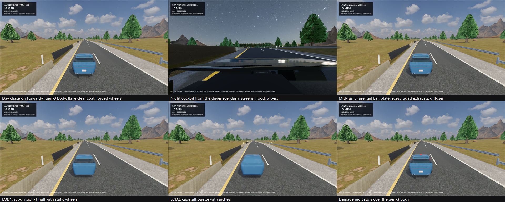

# P1-008 Hero GT generation 3: production surfacing, wheels, cockpit, textures

- Date: 2026-09-04
- Task: P1-008 (Q-020 Option A, project-original grand tourer)
- Code revision: branch `claude/p1-008-hero-gt-aa-20260904`
- Platform: Windows 11 Pro 10.0.26200, RTX 3080 Ti; Godot
  `4.7.1.stable.mono.official.a13da4feb`; Blender `5.1.2` build `ec6e62d40fa9`
- Working choice: Q-020 Option A (project-original Hero GT); Q-040 remains
  open on whether a licensed model replaces it

## Outcome

The second-generation Hero GT of 2026-09-02 (a lofted hull with primitive
parts, ten flat materials, no textures) is replaced by a third-generation
model built by the same script path and validated through the same gates,
with the same 37-node contract, wheelbase, track, wheel radius, rest length,
three LODs and box collision proxy. It is designed to a sourced proportion
sheet, has real panels with shut lines, conformal lamps and apertures,
production-style wheels and brakes, a leather-and-suede cockpit, and
checksum-locked CC0 PBR textures. The Godot wrapper drives its materials from
the extras the export writes, including a flake clear-coat paint shader.

| Measure | Generation 2 | Generation 3 |
| --- | --- | --- |
| LOD0 triangles | 16,634 | 108,039 |
| Total triangles | 19,498 | 125,233 |
| Materials | 10 | 27 |
| Textures | 0 | 27 (10 CC0 sets at 1K and 2K) |
| GLB | 1.1 MB | 31.9 MB (textures embedded) |
| Imported nodes | 112 | 207 |
| Mesh objects | 37 | 170 |

## What was built

- **Proportions.** `docs/audits/p1-008/2026-09-04-hero-gt-proportion-sheet.md`
  derives an original front-engine GT from DB12, Vantage, Roma, 812, AMG GT
  and LC 500 measurements: 4.77 m long, 1.95 m wide, 1.30 m tall, 0.93 m
  front and 1.00 m rear overhangs, 62-degree windshield, roof peak 1.82 m
  behind the front axle. `tools/vehicles/hero_gt/spec.py` holds every station
  and longitudinal spline.
- **Body surfacing** (`hero_gt/body.py`). One watertight cage: 26-point loops
  at 50 longitudinal stations evaluated from splines for the silhouette,
  beltline, plan width, shoulder, sill, floor and cantrail, with arch
  blisters and a Coke-bottle waist. Crease weights on the floor edge, sill,
  shoulder, belt and cantrail keep character lines through two levels of
  Catmull-Clark subdivision. Exact-boolean cylinders cut the arches. The
  nose and tail are ladder-filled so subdivision rounds them instead of
  pinching a 26-gon. Faces carry a panel id; after subdivision the hull is
  split into body, roof, hood, trunk, doors and bumper covers. Panels shrink
  by half the shut line (3 mm, 4 mm at bumper seams) and every open boundary
  is extruded inward as a dark wall, which is what makes the gaps read.
- **Apertures** (`hero_gt/parts.py`). Booleans cannot cut an open shell, so
  each convex cutter bisects the panel by its face planes and the enclosed
  faces are lifted out as an aperture piece. Recess floors with walls, the
  perforated grille and intake meshes, headlamp housings with projector
  bezels and LED strips, lens covers, the tail lamp bar, the plate recess
  and the exhaust bores are all offset copies of those pieces, so they
  conform to the body exactly. Splitter, sill blades, diffuser, mirrors,
  handles, wipers, antenna and badges are separate parts.
- **Wheels** (`hero_gt/wheels.py`). 275/35 R20 tyres with four
  circumferential grooves and the TextureCan tread set wrapped around the
  circumference; five twin-spoke forged rims with a flush lip and shallow
  dish; 380 mm drilled discs (three rings of holes cut with an exact
  boolean), hats and six-piston calipers parented to the suspension anchors
  so they stay still while the tyre and rim rotate.
- **Cockpit** (`hero_gt/interior.py`). Dash with binnacle, cluster and
  centre screens, console with drive knob, bucket seats with bolsters and
  suede centres on carbon shells, door cards with armrests and pulls,
  steering wheel and column, pedals, bulkhead, parcel shelf, mirror and
  headliner. The wrapper no longer hides the interior from the cockpit
  camera; only the glass and roof are excluded.
- **Materials and textures** (`hero_gt/materials.py`,
  `data/assets/vehicles/sourced-materials.lock.json`). Ten CC0 sets
  (ambientCG leather x2, carbon twill, brushed and machined metal, grained
  plastic, clear-coat orange peel, perforated sheet; TextureCan tyre tread;
  Poly Haven suede) are locked with provider metadata, archive SHA-256 and
  per-member SHA-256 through the extended `tools/environments/sourced_assets.py`,
  which now handles zip providers. Blender packs the images into the source
  and embeds them in the GLB. Each material records `cv_*` custom properties
  that arrive in Godot as `extras` metadata.
- **Godot side.** `assets/vehicles/hero-gt/shaders/car_paint.gdshader` is a
  hashed per-cell flake normal under Godot's clear coat with an edge-tinted
  flop and the orange-peel normal in object space.
  `VehicleVisualRig.PolishImportedMaterials` reads each material's extras and
  applies the paint shader, transparent depth-sorted glass, clear-coated
  carbon, metal and alpha-scissor grilles, falling back to material names for
  the earlier asset. `pack_imported_scene.gd` redirects the textures the
  importer extracts to `assets/vehicles/sourced/hero-gt/`, which the release
  presets exclude with the rest of the sourced art until the rights records
  are approved.
- **Contract.** The exporter's budgets rise to 150k LOD0 and 200k total
  triangles, 32 materials, 48 textures and 96 MB of texture bytes, and
  packed images are accepted where any file-backed image was refused before.
  ADR-0012 left exact budgets open until representative assets existed;
  these are the representative numbers and P1-013 ratifies or trims them.
- **Capture path.** `scripts/capture-scenario.sh` takes `--renderer` (or
  `CANNONBALL_CAPTURE_RENDERER`) so the review frames in this audit come from
  the Forward+ renderer the ADR-0023 target is measured on.

## Verification

| Check | Result |
| --- | --- |
| `create_hero_gt.py` | `CANNONBALL_HERO_GT_FACES lod0=52896 total=60834 meshes=170` |
| `validate_and_export_hero_gt.py` | `CANNONBALL_HERO_GT_EXPORT_OK triangles=125233 lod0=108039 materials=27` |
| `pack_imported_scene.gd` then `validate_import.gd` | `CANNONBALL_HERO_GT_IMPORT_OK nodes=207 triangles=125233`, 37 required nodes resolved, 213 material extras preserved |
| `validate_manifest.mjs` | `CANNONBALL_ASSET_MANIFEST_OK asset=hero-gt artifacts=9 nodes=37` |
| `sourced_assets.py verify` | `CANNONBALL_SOURCED_ASSETS_OK assets=10 files=35 bytes=24708127 license_statuses=pending-human-review` |
| `run-scenario.sh --profile vehicle-visual` | all eight stages |
| `run-scenario.sh --profile integrated-visual-slice` | `CANNONBALL_INTEGRATED_VISUAL_SLICE_OK vehicle=hero-gt vehicle_semantic_nodes=37 road=production` |
| `run-scenario.sh --profile vehicle-dynamics` and `--profile camera-handling` | pass on the corrected ride height |
| `dotnet test` | 145 passed |
| `capture-scenario.sh --vehicle-visual-review --renderer forward_plus` | review sheet above |

## Defects found and fixed on the way

- An exact boolean on an open panel splits the surface but welds the
  cutter's own faces into the result; the grille cavity rendered as a blue
  block on the nose. Apertures are now plane bisections plus an inside test.
- Newly extruded rim vertices had no normal, so rim walls flew off in random
  directions as black fins; the walls now take the source vertex's normal.
- The proportion sheet's 0.81 m front fender crest sat below the arch top a
  20-inch wheel needs; the crest was raised to 0.865 m and the arch gap
  trimmed to 55 mm.
- The tail lamp bar straddled the bumper-to-deck seam and only the bumper
  sliver was cut; it moved to 0.80 m.
- Relative exporter paths resolve against the .blend directory, and the
  importer extracts embedded textures next to the scene; the chain passes
  absolute paths and the packer redirects the textures.
- The collision proxy box has always been exported and drawn; the old
  slab-sided body hid it inside. The tucked-under sills and tapered tail of
  this body exposed it as black slabs, so the wrapper now hides that node.
- From the cockpit camera the front tyres showed through the fenders: the
  exterior shell is single-sided and nothing sat behind the fender skin. The
  wheel-well liners are now double-sided so they close the view from inside.
- The LOD2 silhouette hull had no arches, so its wheels sat inside the hull
  and the car appeared to float at distance; LOD2 cuts arches now.
- The paint's hashed flake normal aliased into grain at chase distance; the
  shader fades flake strength with the screen footprint of one cell.
- **The visual rig rode 0.38 m too high, and the body floated while
  driving.** The physics places each wheel 0.18 m below the chassis origin
  and hangs it a further 0.54 m at zero compression; with 1,450 kg over four
  42 kN/m springs it compresses 0.085 m at rest, so the chassis rests 0.975 m
  above the road. The wrapper mounted the rig 0.76 m below the chassis and
  the rig raised anchors from a 0.66 m rest height, which put the visual
  wheels 0.38 m above the physics wheels at every compression and left the
  body 0.215 m above the road while driving. Review captures hid it: they
  freeze the car at 0.78 m, where the body happens to sit right and the
  tyres ride up into the arches. The front tyres of this lower-hooded body
  stood above the roof line in the Forward+ capture, which is how it
  surfaced. The mount height and the review height are now derived from the
  physics constants (0.975 m), the anchors rest at the extended physics
  wheel height (0.255 m above the design ground) and the contact anchors at
  the extended tyre bottom, so the visual wheels coincide with the physics
  wheels and the body sits at its design height at static ride height.
- The integrated-visual-slice scenario crashed in the .NET shutdown
  finalizers after passing, once the wrapper held managed wrappers for 170
  meshes and 213 materials; every wrapper the polish pass takes is now
  released before the next mesh, matching the damage-indicator pattern.

## Defect found after the merge

- The PlayGodot semantic suite failed on all three runners after #116
  merged (M0 is the only merge gate, so the merge went through). The suite
  launches the game without importing the project, which the M0 scenario
  runner does; a fresh checkout therefore had the generated scene's
  twenty-six sourced-texture dependencies unimported, and Godot refuses to
  load a scene with a missing dependency. The wrapper then threw "missing
  semantic node AssetRoot" and the cockpit toggle threw for the missing
  cabin mesh, so the visual-rig descriptor carried no state and the camera
  test failed on the first read. The second-generation model had no texture
  references, which is why the gap never showed. `verify-playgodot.sh` now
  imports the project the way `run-scenario.sh` does, and the suite pins the
  wrapper's cockpit exclusion names (cabin and roof spine) rather than the
  old count of three from the first-generation placeholder interior. The
  live suite was not run locally before the merge; it is now part of the
  pre-merge routine for vehicle changes.

## Claims not made

- No human has approved the design, materials or rights; Q-020's art gate
  and Q-040 stay open and the ten new sourced records are pending review
  (Q-037 pattern). The sourced folder stays out of release presets.
- No baked occlusion or curvature maps yet; contact shading comes from SSAO.
- Under full bump (0.54 m of travel in the physics profile against a 55 mm
  arch gap) the tyres still enter the wells and can reach the hood; the
  liners hide that from outside and the cabin. Whether the profile's travel
  or the arch gap gives is a P1-013 question.
- The PCK audit stage of `verify-vehicle-asset.sh` was not run on this
  machine (no Mono export templates).
- No frame-time claim; the reference matrix was not re-run.
