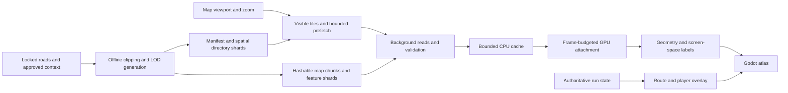

# Realistic streamed highway atlas: research and design

- Date: 2026-09-06 (America/Los_Angeles); online checks continued on 2026-09-07 UTC.
- Task: P1-016, M3; design claim: PR #135.
- Inspected baseline: `7453dff816b3d0f6e3d5c695b2c86a3dd62d7e47`.
- Owner request: research and design a realistic map, readable when zoomed in,
  focused on the game's highways, with the entire map streamed. The owner
  explicitly confirmed the 2D map scope.
- Status: design proposal. No renderer, schema, source catalog, route lock, or
  production content changes. [ADR-0027](../decisions/ADR-0027-streamed-highway-atlas.md)
  records the proposed architecture; Q-045 tracks its disposition.

## Recommended experience

Build a geographic road atlas in the existing Godot full-screen map. At country
scale the player sees the three coast-to-coast choices, states, major cities,
water, and terrain. Zooming reveals highway shields, towns, interchanges, exit
numbers and destinations, rest areas, services, and the road connections needed
to reach playable stops. Text stays readable while geometry becomes more detailed.

The atlas has its own spatial tile pyramid, loader, cache, and draw budgets.
Every geographic layer, including the overview, loads on demand. A small
manifest locates data; it contains no country-sized geometry or label list.
Opening the map at New York and panning to California must work without loading
a single California 3D road chunk.

Recommend installing the complete supported atlas as content-addressed chunks
and streaming those chunks from disk into memory. This satisfies streaming
without a permanent internet dependency. Remote delivery can later supply the
same immutable chunks; it is a separate transport choice, not a prerequisite
for map navigation. Installed size and resident memory are separate budgets.

Realism means correct geography, route identities, and verified readable
information. It does not establish live business availability or survey-grade
accuracy. The design must expose missing coverage honestly, and production
completion requires resolving the information gaps below.

## Existing system and bounded geography

[ADR-0011](../decisions/ADR-0011-lane-topology-route-context-and-trip-map.md)
already establishes an engine-independent map using immutable geometry and
authoritative run state. Preserve that boundary and P0-013's solo pause rule.
The current [canvas](../../game/UI/TripMap/TripMapCanvas.cs) uses a dark grid,
whole-path strokes, feature markers, and zoom from 0.75 to 8 times the fitted
overview. [TripMapProjection](../../src/Cannonball.Core/Simulation/TripMapProjection.cs)
chooses a common route LOD within a 20,000-point default budget. Schema 5 embeds
LODs 0-2 in the route payload, with a 16,000,000-byte map limit. Increasing the
zoom multiplier alone cannot add absent geographic detail or stream that payload.

Use the exact segment and edge membership from
[route-selection.v1.json](../../data/routes/continental/route-selection.v1.json)
and its validated successors. The policy contains **3 paths, 15 segments, and
22 distinct states**. A road-number filter alone would incorrectly import whole
Interstates beyond their selected endpoints.

| Route family | Highway scope |
| --- | --- |
| Central Rockies | Manhattan public-road connector; Lincoln Tunnel, NJ 495, NJ 3, US 46; I-80 to Big Springs; I-76 to Denver; I-70 to Cove Fort; I-15 to the Los Angeles approach |
| Northern Plains | Shared eastern I-80; I-80 through Wyoming to Salt Lake City; I-15 south to the Cove Fort merge |
| Southern I-40 | Manhattan/Holland Tunnel connector; I-78 to I-81; I-81 to I-40; I-40 to the Barstow merge |
| Shared finish | I-15, I-10, I-405, CA 107/Hawthorne Boulevard, then the selected authored Redondo Beach connector |

These are facility selections, not a claim that every connector or exit is
production-ready. The current
[carriageway lock](../../data/routes/continental/westbound-carriageway-lock.v1.json)
records 2,825.10 canonical portal-to-portal miles and 2,891.68 northern miles,
but leaves the southern distance unpublished because `nyc-start-to-i78` is not
authored. Those are version-specific lock values, not hardcoded UI labels or
completed traversal evidence. P0-021 remains in progress.

Generate one deduplicated atlas for the union of those paths. Mark each feature
as `playable`, `context_only`, or `unavailable`. Supported ramps, authored
endpoint roads, and service access belong to the playable graph only when their
explicit connections exist. Nearby crossing roads may appear as short, subdued
context and carry a destination name; they cannot become selectable routes.
Opposing carriageways may provide context without adding a reverse-driving mode.

For coarse context, tile the supported graph's full geographic bounding area
with modest padding. For detailed context, start with a **proposed 5 km buffer
on each side** of the supported roads, expanded to complete interchanges and
playable service areas. Include relevant whole water features or name anchors
as needed before clipping. Buffer width is a sampling parameter, not a grant to
acquire every local street or a measured optimum. Outside detailed coverage,
retain generalized context and a clear coverage boundary at close zoom.

## Cartographic design and zoom contract

Use warm off-white land, pale blue water, restrained green land cover, fine gray
boundaries, and very subtle shaded relief. Highways use a contrasting casing,
recognizable Interstate/US/state shields, and clear bridge/tunnel treatments.
The selected path is blue with a white casing, traveled portions add a distinct
pattern, and alternatives remain visible in a subdued stroke. Shape, casing,
text, and pattern must carry meaning independently of color. Offer a dark atlas
palette using the same hierarchy, and a relief toggle for legibility.

The table is a proposed display contract, expressed in approximate ground
meters per logical display pixel at the view center. Actual transitions depend
on latitude, viewport size, text scale, source fidelity, and measured density;
they are not claimed performance results or fixed web zoom numbers.

| View | Approximate scale | What becomes readable |
| --- | --- | --- |
| Whole trip | 2,000-500 m/pixel | All three supported routes, major transfers, endpoints, major cities, state names/borders, broad water and terrain |
| Region | 500-100 m/pixel | Repeated highway shields, primary concurrent identities, regional cities, named mountain areas, major rivers, toll-road names where verified |
| Corridor | 100-20 m/pixel | Towns, verified exit numbers, rest areas and playable service symbols; grouped exits separate as space allows |
| Interchange | 20-2 m/pixel | Individual supported ramps and carriageways, signed exit destinations, suffixes, crossing-road names, direction and bridge/tunnel relationships |
| Stop/access | 2-0.5 m/pixel | Validated local access geometry, reachable entrances, facility names and service details; this level is enabled only where evidence supports it |

Draw labels in screen space, normally 14-18 logical pixels, with adjustable UI
scale, restrained halos, and symbol spacing. Never magnify a bitmap containing
text or shrink labels to fit a denser zoom. At small text sizes compare hinted
dynamic fonts with MSDF; Godot documents MSDF's scaling benefits and its poorer
small-size hinting. Prewarm the chosen glyph set to avoid first-use pauses.
[Godot font documentation](https://docs.godotengine.org/en/stable/tutorials/ui/gui_using_fonts.html).

Build deterministic label candidates offline, including stable feature IDs,
anchors, allowed zooms, importance, abbreviation variants, and shield groups.
At runtime lay out the visible tiles and their overlap margins together. Keep
stable placements across small camera movements; use zoom hysteresis and fade
transitions. Deduplicate cross-tile candidates by feature ID, including during
parent/child transitions. Selected features and critical transfers have highest
priority; then route shields, exits/services, towns, and background labels.
An active label must fit entirely in a safe viewport region or move to the
selection panel. Overflow remains accessible in the feature list.

Preserve all signed concurrency in data and show the complete shield group on
selection. Mileposts come from the local route-reference system, with direction,
state resets, and discontinuities. Neither exit numbers nor mileposts may be
computed from trip mileage. These are existing
[ADR-0017](../decisions/ADR-0017-authoritative-route-context-and-concurrency.md)
requirements, including the distinction between observed, derived, authored,
and unknown values.

The full-screen layout keeps most space for the map. A narrow top bar contains
the route family, authoritative trip progress, and applicable ETA. A collapsible
selection panel shows the selected exit, service, transfer, or place. A bottom
strip carries the scale bar, legend, and input hints. Avoid a dense permanent
dashboard. The user can zoom about the pointer, pan, fit the entire trip,
recenter on the vehicle, and search supported highways, exits, towns, and
playable stops. Search ranks names and aliases from a separately streamed index;
searching must not load all labels or geometry.

Keyboard and controller navigation use the same selected feature model, with a
list alternative to precision pointing. Opening the map pauses solo driving and
the run clock while atlas I/O and UI processing continue. Map input is isolated
from driving input. Closing it cancels obsolete map work, preserves a bounded
warm cache, and resumes through the existing held-input suppression contract.

## Data research: what is supported and what is missing

The current catalog admits NHPN, NHS, NAIP for break evidence, and 3DEP for
elevation. Additional map context is a proposed catalog extension. Government
hosting alone is not proof that all embedded layers meet the project's rights
or ancestry rules. No source is added by this design.

| Need | Recommended source or contract | Evidence and limitation |
| --- | --- | --- |
| Supported road shape and connectivity | Validated P0-021 reconstruction, lane/junction locks, and accepted authored connectors | Keeps the map aligned with the game. Derive all LODs from the same highest accepted geometry; NHPN linework cannot support exact close-up ramps. |
| Highway identities and some reference measures | Existing NHPN/NHS locks and route-context records | Live NHPN and NHS layer metadata were inspected on 2026-09-07 UTC. Their fields include signed routes, local names, and measures. Neither inspected schema contains dedicated exit-number, signed exit-destination, or service-business fields. This is a bounded schema finding, not a survey of every federal product. |
| State, county, city and urban boundaries | Proposed Census cartographic boundaries for small scales; detailed non-road TIGER/Line layers inside the corridor | Census publishes several generalization scales and documents statistical boundaries and variable positional accuracy. Use these for context, not legal parcel boundaries. Census's reproduction statement is in section 1.2 of its 2025 technical documentation. |
| Towns and named natural features | Proposed USGS GNIS DomesticNames, FederalCodes, or FullModel | Current downloads include natural features and populated places, with stable identifiers and source metadata. The archived 2021 administrative features are unmaintained. GNIS is a gazetteer, not a current service-business directory. |
| Rivers and lakes | Proposed USGS 3DHP where available, with a pinned legacy NHD baseline where necessary | USGS is transitioning to 3DHP; legacy coverage remains a bridge. Pin product and geographic coverage rather than promising a uniformly current national layer. Inspect exact lineage and metadata before catalog admission. |
| Terrain and contours | Existing approved 3DEP product families, with new product locks if wider context is required | Derive relief/contours offline. The current elevation corridor lock is not proof of full atlas-background coverage. Broader low-resolution context needs its own bounded acquisition and datum record. |
| Exit numbers, signed destinations, rest/service areas, toll facts | Exact public-domain authoritative records where available, plus provenanced authored facts under ADR-0017 | This is a separate corridor inventory and reconciliation workload. Check state, turnpike, tunnel and facility operator records individually. A publicly viewable or CC BY feed does not meet the current public-domain-only geodata rule automatically. |
| Lane/access attributes if needed | Cataloged NHS fields first; HPMS 2024/ARNOLD deepening under ADR-0026 | FHWA documents section attributes and public-domain status, but also geometry/export limitations. Section statistics do not establish every ramp, destination sign, or service. |
| Shields and service pictograms | Project-owned artwork informed by FHWA SHS and accepted state-specific visual rules | FHWA publishes sign drawings, including phased SVG/EPS/PDF releases. Map-sized symbols need optical simplification. Pin the source edition and provenance; do not copy a commercial map's symbol atlas or agency logos. |

Primary sources for this table, checked during this investigation:

- [BTS NHPN layer and field metadata](https://services.arcgis.com/xOi1kZaI0eWDREZv/arcgis/rest/services/NTAD_National_Highway_Planning_Network/FeatureServer/0?f=pjson)
  and [BTS NHS layer and field metadata](https://services.arcgis.com/xOi1kZaI0eWDREZv/arcgis/rest/services/NTAD_National_Highway_System/FeatureServer/0?f=pjson).
  Both returned HTTP 200; saved research metadata hashes are recorded in P1-016
  evidence. These research snapshots were not ingested into the route pipeline.
- [Census cartographic boundary products](https://www.census.gov/geographies/mapping-files/time-series/geo/cartographic-boundary.html)
  and [2025 TIGER/Line technical documentation](https://www2.census.gov/geo/pdfs/maps-data/data/tiger/tgrshp2025/TGRSHP2025_TechDoc.pdf),
  especially sections 1.1-1.2 and 3.3.4-3.3.6. The document is a verified candidate
  edition, not a claim that it will be the latest edition at acquisition time.
- [USGS GNIS downloads](https://www.usgs.gov/us-board-on-geographic-names/download-gnis-data),
  [USGS reproduction guidance](https://www.usgs.gov/faqs/are-usgs-reportspublications-copyrighted),
  and [3DHP access and transition guidance](https://www.usgs.gov/3d-hydrography-program/access-3dhp-data-products).
- [FHWA HPMS 2024 full export documentation](https://github.com/FHWA/HPMS/blob/2024-HPMS/README_2024_HPMS_All.md)
  and [FHWA Standard Highway Signs releases](https://mutcd.fhwa.dot.gov/kno-shs_2024-release-status/).

For every required real-world semantic field, record a source record or document
reference, geographic/jurisdiction scope, observation date, acquisition time,
artifact SHA-256, value class, and any authored reconciliation. Preserve route,
exit, and facility IDs across tiles. Keep business names, service category,
physical entrance, and in-game availability separate. In-game fuel prices,
closures, and risk are run-state overlays, never presented as live real-world
facts. A real business label requires a verified record; a project-created
facility must be identified as game content.

Make a coverage matrix for each route segment: required exit inventory, verified
exit numbers/destinations, route identities, service areas, reachable selected
stops, and place labels. The denominator must come from an independently checked
inventory, not the features that happened to download. Record unknowns and
conflicts explicitly. Release scope may omit nonessential unknown fields, but
cannot silently substitute that for the owner's requested complete detail.
Q-045 keeps incomplete production coverage visible until adjudicated.

## Rendering and packaging choice

| Option | Assessment for this project |
| --- | --- |
| Native Godot vector drawing with independent FlatBuffer map tiles | Recommended. Reuses the engine, Python/PROJ pipeline, portable readers, stable IDs, and content hashes. Requires project work for symbol layout, clipping, and tile scheduling; prove those costs in a pilot. |
| MapLibre with MVT and PMTiles | Credible comparison for a pilot if native cartography misses a declared gate. PMTiles supports on-demand byte-range reads, but a production Godot integration, packaging and platform behavior have not been validated here. No selected tool is replaced by this research. |
| Predrawn raster map pyramid | Suitable for label-free relief. Baking names into images limits text scaling, selection, accessibility, and dynamic route styling; it is a poor fit for the primary labeled atlas. |

[PMTiles](https://docs.protomaps.com/pmtiles/) is a container and addressing
mechanism, separate from its contents. Its read-only archive supports fetching
the needed ranges. The ready-made
[Protomaps basemap](https://docs.protomaps.com/basemaps/downloads) derives from
OpenStreetMap and is incompatible with this repository's shipping policy.
Do not turn a format evaluation into basemap adoption. Likewise, admission of
Census boundaries here would not authorize TIGER road geometry: ADR-0026 permits
its road layer only as a cross-check witness. A changed use requires an explicit
amendment.

Prefer map display tiles in EPSG:3857 with XYZ addressing and a 512-logical-pixel
reference tile. [PROJ documents Web Mercator](https://proj.org/en/stable/operations/projections/webmerc.html)
and the EPSG identifier. Keep EPSG:5070 in the current metric reconstruction
pipeline; reproject its validated output for display only. Store source CRS and
the exact PROJ transformation/version in provenance. Compute route distances in
the authoritative route model and the scale bar from an inverse projection and
geodesic distance across the visible bar. Projected Mercator meters are not
ground mileage. Keep world coordinates in doubles, subtract the map camera
origin in double precision, then convert to Godot floats. The map camera origin
is independent of 3D origin rebasing.

Start the pilot with display zooms roughly 4-18; permit closer zoom only with
validated geometry. Build sparse high-detail tiles only for the corridor mask.
Use topology-preserving simplification from one accepted geometry, retaining
transfer anchors, edge-distance mapping, and shared clipped boundaries. Measure
screen error and source error separately; extra vertices cannot create source
accuracy. Pre-triangulate polygon fills and prepare line buffers offline where
practical. Independently tiled, label-free relief can use the existing Godot
texture path with bounded upload work.

Proposed contracts, to be specified in a subsequent schema slice:

| Artifact | Contents |
| --- | --- |
| Route root map reference | Map manifest hash, supported map schema, graph/semantic binding; no atlas geometry |
| Map manifest | Content/style/projection versions, geographic bounds, sparse zoom coverage, references to regional directory shards, source-manifest references, bootstrap tile references |
| Directory shard | Tile keys, bounds, child availability, layer bits, declared encoded/decoded sizes, content hashes, immutable chunk references; no all-country feature table |
| Map tile | Version and tile key, quantized local geometry, stable feature/edge IDs, edge-distance correspondences, layer/vertical order, context/playable status, bounded string tables and label candidates |
| Feature/search shard | Stable record IDs, normalized names and aliases, short result summaries, geometry-tile references, complete route/exit/service metadata on demand |
| Run overlay | Current edge plus distance, selected path, ordered traveled-edge occurrences, planned stops and simulated conditions; no copied basemap or authoritative state stored in tiles |

Permit several independently keyed tiles per hashable chunk to avoid tiny-file
overhead, but cap the read/decode unit. Index and group by spatial locality after
measuring request amplification. Preserve the existing strict root limit below
64,000,000 bytes and independently hashed shipping chunks below 16,000,000 bytes
under [ADR-0019](../decisions/ADR-0019-route-package-budgets-and-audit-reproducibility.md).
Do not silently reuse the current 16 MB embedded-map allowance for a continent
of detailed labels.

New route packages use an explicitly versioned atlas-reference mode and move
the entire map pyramid out of the root. Old schema-5 packages retain their
existing embedded-map interpretation and limit. New readers support both modes;
old readers reject unsupported new content clearly. Allocate the exact schema
version during the schema claim to avoid concurrent writers. Preserve old saves
and content migrations; changing map style alone must not change route position.
Never mix tiles bound to a different graph/semantic version into the current run.

## Streaming lifecycle and failure behavior

1. On map open, read the bounded manifest and directory path for the saved view.
   Read coarse coverage tiles first. The shell and controls respond while data
   arrives; geographic content is never a startup-wide allocation requirement.
2. Select tiles for the viewport and effective scale. Prefer visible coverage,
   then its required parent fallback, then a one-tile prefetch ring biased toward
   pan velocity. A far search result goes directly to that location; it does not
   fetch every intermediate tile across the country.
3. Bound both concurrent work and bytes reserved before scheduling. Start with
   at most four reads and two CPU decode jobs, subject to measurement. Coalesce
   duplicate keys, cancel obsolete views with generation IDs, and limit queued
   work. Under pressure reduce prefetch, then optional relief, then displayed LOD.
4. Read, hash-check, bounds-check, and decode plain data off the main thread.
   Reject excessive lengths, decoded-size declarations, feature counts, or
   unsupported versions before allocating. Use reusable buffers. Resource and
   GPU work is attached in bounded batches on the main thread; do not create one
   node per map feature. Godot's
   [thread-safety guidance](https://docs.godotengine.org/en/stable/tutorials/performance/thread_safe_apis.html)
   rules out arbitrary active scene-tree mutation from workers. For engine
   resources, [threaded loading](https://docs.godotengine.org/en/stable/tutorials/io/background_loading.html)
   still requires a completed-status check before retrieving to avoid a block.
5. Keep the last validated parent visible until its children are ready, replace
   only the covered region, and deduplicate both labels and route strokes during
   transition. Missing sparse children mean use the declared coarser coverage;
   they are distinct from a failed read. Query visible edge fragments and path
   membership rather than rebuilding every point of the entire traveled trip.
6. Evict by byte weight and recency, with explicit pinning only for visible and
   necessary parent tiles. CPU geometry, GPU geometry, glyphs, relief textures,
   metadata, and in-flight buffers all count. Closing the map cancels pending
   jobs and trims to a small measured warm-cache target; it does not retain all
   locations the player visited.

A failed chunk preserves the last verified coarser tile and reports unavailable
detail without removing the route selection. Retry a bounded number of times,
then offer retry or content repair. A cold first-open failure has no parent to
display: keep the controls and route summary usable with a clear loading/error
state rather than fabricate geography. The installed/offline path covers all
supported areas; an optional future remote cache must support partial-file
cleanup, atomic promotion after verification, disk quota/backpressure and
version-pinned manifests. Live government map services are never runtime
dependencies. Atlas failure does not mutate saves or block safe map closure.

## Provisional budgets and measurable acceptance

These numbers are **pilot hypotheses**, not measurements or ratified production
limits. Tune them from the representative urban, mountain, and rural samples
before adoption. Existing ADR-0019 package ceilings and ADR-0023 scene gates are
unchanged.

| Measurement | Starting hypothesis / acceptance method |
| --- | --- |
| Atlas manifest | At most 1 MiB; regional directories and search records remain sharded |
| Resident CPU allocations attributable to the atlas | At most 160 MiB total: 96 MiB decoded data/directories, 32 MiB labels/search, 32 MiB in-flight and staging buffers |
| Resident GPU allocations attributable to the atlas | At most 96 MiB total: 32 MiB geometry, 48 MiB relief, 16 MiB glyphs/symbols; report allocator/driver overhead separately |
| Main-thread attachment work | At most 1 ms per frame in the pilot; measure work size and worst individual operation as well as averages |
| Local SSD first map overview | p95 at most 500 ms from opening to validated geographic coverage; UI interaction available earlier; measure cold filesystem cache separately from warm app cache |
| Newly visible local detail | p95 at most 200 ms after pan/zoom settles; retain coarser coverage during the wait |
| Label integrity | Zero duplicate stable label IDs or intersecting critical-label rectangles in settled fixtures; bounded label motion during pan and parent/child transitions |
| Bounded working set | A 30-minute repeated country/interchange tour plateaus; report high-water, post-warm-up slope, and outstanding work after closure |
| Map/world isolation | Remote panning triggers zero 3D visual/collision chunk requests; pause/resume preserves run clock and authoritative state |

The sum of the two proposed residency pools is 256 MiB of accounted map
allocations, not an assertion about process-wide or driver memory. Every staging
allocation must fit its pool before work begins, and over-budget visible sets
must degrade predictably rather than temporarily loading everything.

Reference captures follow the **current**
[ADR-0023](../decisions/ADR-0023-reference-performance-target-and-layered-budgets.md):
2560x1440 High at 60 FPS on the declared Windows PC; uncapped p95/p99 and the
20 ms steady-driving stall threshold, with the separate ratified cap-adherence
path for capped captures. A new interactive-atlas scenario should measure its
own warm pan/zoom hitches at the same 20 ms investigation line. Do not copy the
superseded 50 ms criterion from older notes. Production subsystem allocations
remain P1-013 work.

Tile count and total installed size are **not yet measured**. First build a
locked 100 km sample in each of dense urban, mountain, and rural conditions.
Report occupied tiles by zoom, encoded/decoded bytes, labels per tile, directory
overhead, compression and chunk read amplification. Extrapolate using the
union's actual corridor area/length and class mix, accounting for shared tiles;
do not multiply one route's mileage by three. Keep high-zoom relief sparse if it
dominates storage. No national download or shipping-size promise is justified
by this design alone.

## Delivery sequence and evidence

| Slice | Owned implementation scope after a separate claim | Exit evidence |
| --- | --- | --- |
| A. This research/design | This audit, proposed ADR, Q-045, ledger, evidence | Verified sources and baseline, explicit decisions/gaps, link/schema validation; runtime remains unimplemented |
| B. Coverage and art pilot | New source/feature inventories and offline cartographic samples; coordinate catalog/lock ownership with P0-021 | Three locked 100 km samples; readable zoom states; exit/service inventory denominators; source rights and ancestry dispositions; measured size estimates |
| C. Tile contract and compiler | New map schema/generator, pipeline module, portable map reader, fixture data | Byte-identical builds twice on Linux/Windows; semantic audit equivalence; topology/seam/coverage tests; size and malformed-input checks; version compatibility |
| D. Native atlas runtime | Map viewport, bounded scheduler/caches, batched rendering, label layout and search | Rapid zoom reversal, cross-country jumps, partial reads/corruption, text scaling, memory plateau, map/world isolation, and pause/resume scenarios |
| E. Complete supported graph | Validated P0-021 content plus all selected atlas corridors/connectors | Complete coverage matrix for all 15 policy segments, all three paths, concurrent route and jurisdiction semantics; unresolved southern connector cannot disappear behind an overview line |
| F. Production review | Integrated build, reference captures, human review artifact | Linux/Windows required evidence, rendered UI automation, reference-PC performance, new comprehension/accessibility and final source/asset rights approval |

Begin with the Colorado I-70 pilot to reuse existing terrain/road evidence, but
include the New York/New Jersey and Los Angeles interchanges before judging
density, and rural I-80/I-40 before judging service spacing. Exercise the Big
Springs, Cove Fort and Barstow branch/merge semantics, state-border numbering,
concurrent routes, unavailable data and the unfinished southern endpoint.

Core tests cover projection/inverse scale behavior, tile selection, clipping
seams, bounded scheduling, stable IDs, repeated edge occurrences in traveled
paths, map-version mismatches, and exact edge-distance marker placement. Official
engine scenarios exercise pause-safe loading and renderer attachment. Rendered
semantic UI checks cover pan, pointer-centered zoom, controller focus, search,
text scaling, labels across tile borders, and close/reopen. Human review tests
whether people can identify the upcoming exit, distinguish a playable stop from
context, choose a route, and read names at their normal viewing distance.
P0-013's earlier approval does not approve this redesign.

Each implementation slice records exact revision, UTC/platform, tools, source
and output hashes, seed/arguments, commands and exit status, cold/warm cache
conditions, retries/recovery, quantitative comparisons and human-gate reference
or null. No runtime acceptance was exercised by this design document. Its
verification is recorded separately in [P1-016 evidence](../../evidence/M3/P1-016.json).

Research stopped after the renderer/transport alternatives had primary support,
the two current highway schemas were directly checked, candidate contextual
sources were identified, and the remaining uncertainty was narrowed to exact
corridor inventories, source admission, and performance sampling. Additional
general web searches would not establish those production facts.
