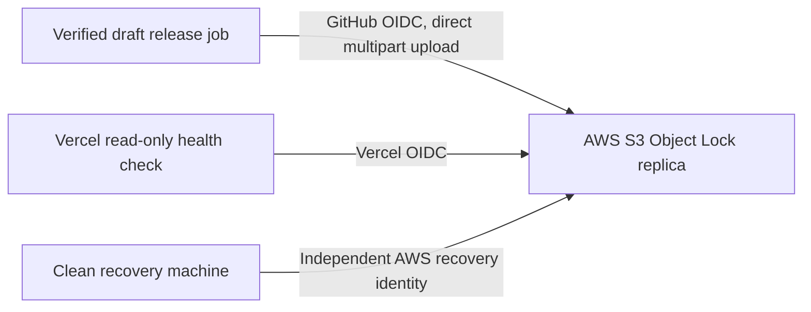

# Independent source-recovery storage research

- Date: 2026-07-16
- Scope: Q-016 and P1-005
- Decision: [ADR-0009](../decisions/ADR-0009-s3-object-lock-recovery-replica.md)

## Result

Vercel Blob is not an immutable disaster-recovery store. It is straightforward
to automate, but Vercel documents blob overwrite, blob deletion, and complete
store deletion. “Treat blobs as immutable” is a naming and caching practice,
not a provider-enforced WORM guarantee.

Amazon S3 satisfies the required storage contract when a general-purpose bucket
is created with Versioning and Object Lock and protected versions use
`COMPLIANCE` retention. AWS documents that compliance-mode versions cannot be
overwritten or deleted during retention, including by the AWS root user.
The selected bucket therefore applies a 365-day compliance rule by default and
verifies the inherited retention metadata on every uploaded version.

Vercel remains useful through its AWS OIDC support. A Vercel Cron Function can
assume a read-only role and independently monitor S3 version IDs, checksums,
retention horizons, and restore-drill freshness without storing AWS access keys.
It should not proxy multi-gigabyte artifacts, and it must not be required for
replication or restoration.

## Capability comparison

| Candidate | Agentic CLI/API | Enforced version retention | S3/API version-deletion resistance | Independent restore | Result |
| --- | --- | --- | --- | --- | --- |
| Vercel Blob | Yes | No documented WORM/Object Lock control | No; the store can be deleted | Vercel-dependent | Reject as recovery authority |
| AWS S3 with Versioning and Object Lock | Yes | Yes, with `COMPLIANCE` retention | Protected versions cannot be deleted through S3 during retention; account loss remains a risk | Direct AWS API/CLI | Select |
| AWS S3 plus Vercel OIDC observer | Yes | Inherited from S3 | Inherited from S3 | Restore does not require Vercel | Select for monitoring |

## Delivery shape

- The draft release job already owns the verified bytes, so direct S3 upload is
  smaller and more reliable than fetching them again through Vercel.
- Content-addressed keys and exact S3 version IDs prevent mutable names or delete
  markers from replacing known bytes. A separately signed and out-of-band
  anchored catalog identifies which versions are authoritative.
- The locked bucket also contains its inventory, manifest schema, restore
  scripts, and infrastructure snapshot so losing GitHub does not lose the
  recovery procedure.
- Replication and checksum/retention verification must finish before publishing
  the GitHub release.
- Quarterly restore drills run from a clean environment with GitHub, Vercel,
  upstream source hosts, and local/CI caches unavailable.

## Security and cost boundaries

- Use a dedicated AWS recovery account and short-lived OIDC sessions.
- The writer cannot delete object versions, administer the bucket, bypass
  governance, or shorten retention.
- An AWS-native retention steward can only inspect and extend retention; it
  covers every version under the protected source, catalog, recovery-kit, and
  drill prefixes and remains operable without GitHub or Vercel.
- Use `COMPLIANCE`, not `GOVERNANCE`, for the committed retention window.
- Prefer SSE-S3 so destruction of a separately managed KMS key cannot make
  locked objects unreadable.
- Start in S3 Standard for 30 days. Measure restore behavior before adopting a
  colder storage class; Object Lock must survive any lifecycle transition.
- Estimate storage, requests, retrieval, and the full retention commitment
  before upload. Alert at USD 5 and USD 10 monthly run rate and block publication
  pending human approval before projected recurring storage exceeds USD 10 per
  month.
- Object Lock cannot prevent AWS account closure, billing loss, or provider-wide
  failure. Keep the bootstrap locator and credential-custody instructions
  outside AWS and reassess cross-account replication as the archive grows.

## Primary sources

- [Vercel Blob overview and overwrite behavior](https://vercel.com/docs/vercel-blob)
- [Vercel Blob object and store deletion](https://vercel.com/docs/vercel-blob/manage-blob-storage)
- [Vercel OIDC access to AWS and S3](https://vercel.com/docs/oidc/aws)
- [Amazon S3 Object Lock](https://docs.aws.amazon.com/AmazonS3/latest/userguide/object-lock.html)
- [Object Lock behavior across storage classes and lifecycle transitions](https://docs.aws.amazon.com/AmazonS3/latest/userguide/object-lock-managing.html)
