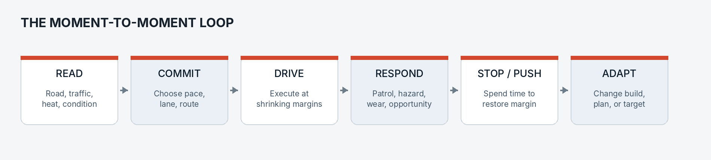
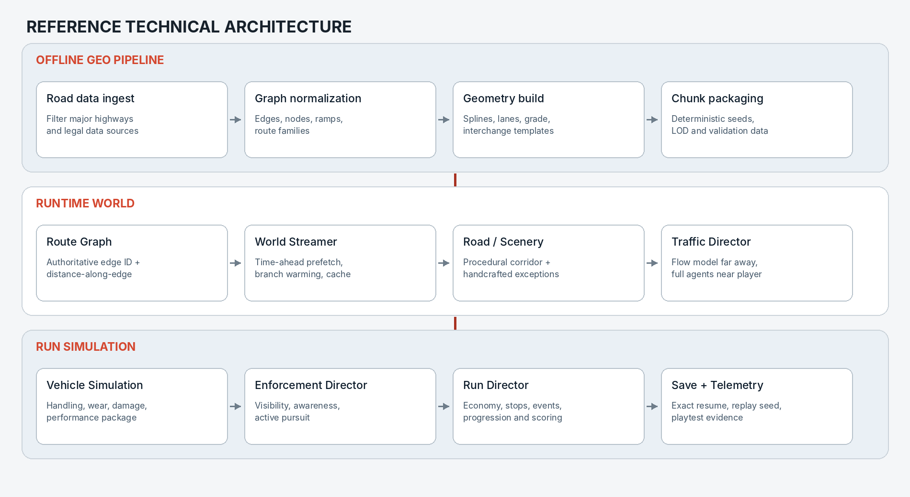

__CANNONBALL RUN__

__GAME DESIGN DOCUMENT  +  MVP TECHNICAL PLAN__

*A coast-to-coast road roguelite where every mile trades speed against survival.*

__VERSION__

0.1

__STATUS__

Concept / pre-production

__OWNER__

Randy

__DATE__

July 2026

__DOCUMENT PURPOSE__

*Translate the concept into a buildable, testable product direction without pretending the biggest unknowns are already solved.*

__ONE-SENTENCE PITCH__

Drive a real-scale interstate network from coast to coast, building the car and managing regional police awareness so you can post the fastest time you are still capable of finishing.

# Decision status

The document distinguishes decisions that should guide implementation now from questions that need evidence. “Locked” does not mean permanent; it means the team should proceed until a prototype gives a reason to change course.

__LOCKED__

Proceed until playtesting disproves it.

__RECOMMENDED__

Default direction; implementation may refine it.

__OPEN__

Requires an explicit prototype or product decision.

# Product at a glance

__Dimension__

__Current direction__

__Genre__

Single-player driving roguelite / road-trip strategy game

__Primary fantasy__

Build and pilot a purpose-made coast-to-coast machine under escalating pressure

__North-star objective__

The fastest time the player can still finish

__World model__

Real highway topology and distance; selective, streamed roadside detail

__Camera__

Cockpit-first with optional chase view

__Platform__

PC first; controller and wheel-friendly, keyboard viable

__Run structure__

Long, save-resumable journey divided into natural 20–90 minute sessions

__Signature mode__

1:1 Endurance Run; shorter Standard Run remains an explicit experiment

__Commercial shape__

Premium game with seeded replayability; no live-service dependency

# Defining run-length direction__   LOCKED__

The 1:1 coast-to-coast Endurance Run is Cannonball's defining primary
experience. Shorter Standard and Challenge modes remain available for
accessibility, experimentation, and repeatable play, using the same real route
distance and content rather than replacing the signature mode. Playtesting
should refine the shorter-mode compression rules without demoting 1:1 travel
to a hidden variant.

# Contents

__01  Vision__

Fantasy, north star, design pillars, and emotional arc.

__02  Game structure__

The run, choice cadence, routes, stops, and session model.

__03  Driving + enforcement__

Handling, damage, awareness, pursuit, and fairness.

__04  Car as build__

Upgrade rules, example technologies, resources, and archetypes.

__05  Progression__

Failure, recovery, roguelite carryover, characters, and variation.

__06  MVP__

Exact scope, non-goals, validation targets, and acceptance criteria.

__07  Architecture__

Map pipeline, streaming, simulation services, saves, and testing.

__08  Roadmap__

Sequenced milestones, research plan, risks, and decision log.

__01  VISION__

*Make the player feel the size of the country, the temptation of speed, and the mounting cost of every decision.*

# Core fantasy__   LOCKED__

The player is not merely driving a fast car. They are preparing, improvising, and nursing a machine across an enormous continuous route while trying to preserve a competitive time. The car becomes a character sheet; the highway becomes a run map; every exit becomes a temptation.

__NORTH STAR__

A successful decision is one that makes the player faster without quietly making the run impossible. A successful run is not “maximum speed.” It is “maximum sustainable aggression.”

# Design pillars

__1. SCALE YOU CAN FEEL__

Distance is not a painted backdrop. Progress across the country is continuous, measurable, and memorable.

__2. SPEED CREATES CHOICES__

Going faster changes fuel use, reaction time, wear, visibility, and the value of every upcoming exit.

__3. LOSS IS LEGIBLE__

The player is warned when margin is disappearing. No random spinouts and no hidden failure planted ten hours earlier.

__4. THE CAR IS A BUILD__

Technology creates styles and trade-offs. Nothing grants permanent immunity from traffic, police, or failure.

__5. EVERY RUN BECOMES A STORY__

Routes, contacts, incidents, and repairs produce a distinct trip rather than a repeated time trial.

# Desired emotional arc

__Phase__

__Player feeling__

__System pressure__

__Departure__

Confidence and possibility

A clean car, full budget, broad route choices

__Early run__

Experimentation

The first build identity emerges; small mistakes are recoverable

__Middle__

Accumulation

Heat, wear, time loss, and route commitments begin interacting

__Final third__

Triage and nerve

The player chooses what to sacrifice and whether to make one last push

__Finish / failure__

Relief, regret, and immediate analysis

The run report explains the result and creates a reason to try again

# Tone and presentation

- A nocturnal road-movie mood: dashboard light, distant city glow, radio chatter, long empty lanes, and sudden bursts of danger.
- Grounded technology with selective fictionalization. The game should feel plausible without becoming an instructional simulation of real-world evasion.
- America is represented through road character, weather, signage, silhouettes, audio, and regional behavior—not a promise to reproduce every town.
- The player should alternately feel powerful, lonely, hunted, clever, exhausted, and lucky.

__02  GAME STRUCTURE__

*A long run composed of frequent, readable decisions rather than thirty hours of holding the accelerator.*

# Run objective and scoring__   RECOMMENDED__

A run begins at a garage near one coast and ends at a finish location near the other. Crossing the finish line is required to post an official result. Elapsed time is the primary score; optional objectives and style metrics break ties and support alternative play styles.

- Primary score: elapsed run time, including stops, detours, citations, repairs, and recovery.
- Required condition: finish with the car and crew legally or mechanically capable of completing the final segment.
- Secondary score: route difficulty, heat managed, repair efficiency, optional jobs, and build-specific challenges.
- Failed runs still produce an end report, discovered intel, and limited meta-progression.

# Core loop

*The loop repeats continuously, with larger route and build decisions layered over it.*

# Choice cadence

__Cadence__

__Question the player is answering__

__Every second__

Where is the car positioned, and how much margin remains?

__30–120 seconds__

Pass, slow down, follow, hide in traffic, or commit to open road?

__5–20 minutes__

Stop or push? Change pace? Accept a route, contact, or upgrade opportunity?

__1–3 hours__

Is this build still coherent? Is the current time target realistic? What must be sacrificed?

__Between runs__

Which car, blueprint, contact, route knowledge, and risk profile should define the next attempt?

# Session model

The in-game journey may be extremely long; the real-world play session should not be. Autosave and exact resume are foundational. A player should be able to stop at any safe moment, return days later, and immediately understand the condition of the run.

- Autosave at route nodes, stops, major incidents, and regular distance intervals.
- Manual suspend anywhere outside an active collision or pursuit resolution.
- Resume panel: route position, elapsed time, target-time range, fuel range, mechanical margin, local awareness, and the next meaningful decision.
- No fatigue or penalty tied to the player taking a real-world break.

# Run length modes__   LOCKED DIRECTION__

__Mode__

__Purpose__

__Initial hypothesis__

__Endurance Run__

The signature experience and technical statement

1:1 distance; approximately 20–30 hours for a strong run, saved across sessions

__Standard Run__

Broader product accessibility

Real topology with 3:1–5:1 travel compression or selective cruise compression

__Challenge Route__

Repeatable testing and mastery

45–120 minute seeded regional runs using the same systems

__IMPLEMENTATION REQUIREMENT__

The map, scoring, and event systems should be expressed in real route distance so mode-specific time or distance compression can change without duplicating content.

The Endurance Run is the defining primary mode. Standard and Challenge modes
must broaden accessibility without changing authoritative route distance or
requiring separately authored world content.

# Route topology__   LOCKED__

The world is a graph, not a corridor pretending to be a continent. The player should face meaningful interchanges and route families with different risk profiles, even when the initial content budget supports only a few viable coast-to-coast paths.

- Edges represent continuous highway segments with length, lanes, curvature, grade, traffic profile, enforcement profile, and service density.
- Nodes represent interchanges, meaningful exits, service hubs, region boundaries, and event attachment points.
- Alternate routes trade distance against traffic, terrain, weather, enforcement, repair access, and contact availability.
- A route choice must remain understandable after it is made; the map should show why an option is faster, safer, or more expensive.

# Lane topology and route context — **LOCKED**

Highways are not fixed-width ribbons. Lane counts may change within a stable
route edge, and junctions explicitly connect incoming lanes to through lanes,
merges, splits, ramps, exits, entrances, and highway transfers. Variable road
width, markings, shoulders, gore areas, barriers, collision, traffic guidance,
and signs all derive from that shared semantic topology.

Roadside mile markers represent the signed highway's local reference system,
including direction, jurisdiction resets, discontinuities, and concurrent route
identities when known. They are not cumulative trip-progress counters. Exit and
transfer signs use semantic route, destination, lane-guidance, and service data;
unknown values remain explicitly derived or authored rather than presented as
false source precision.

# Full-screen trip map — **LOCKED**

The player can open a full-screen map of the complete supported graph. It shows
the start, destination, current position, traveled and planned paths, meaningful
alternatives, selected service stops, upcoming exits and transfers, and real
distance completed and remaining. Mode-aware time or compression estimates may
change, but route distance remains authoritative.

The map is driven by simplified immutable graph geometry and run state, not by
the currently streamed 3D scene. Trip progress follows the chosen graph path
and remains distinct from roadside mile-marker values. Whether opening the map
pauses the simulation is a mode and usability decision that must be resolved
before M3 acceptance.

__03  WORLD, DRIVING + ENFORCEMENT__

*Real geography as a streamed road ribbon, forgiving controls at the input layer, and severe consequences that remain fair.*

# World scope: real backbone, selective detail__   LOCKED__

The game does not build the entire United States as an open world. It builds a continuous highway ribbon plus a limited number of explorable “service bubbles.” This preserves the scale fantasy while containing art, simulation, and navigation scope.

__Layer__

__Representation__

__Highway__

Continuous drivable lanes at real route length and topology

__Interchanges__

Procedural or kit-based geometry with handcrafted exceptions for difficult nodes

__Exits__

Most are signage and route context; selected exits open into compact service bubbles

__Cities__

Skylines, lighting, traffic behavior, audio, and major junctions—not street-complete replicas

__Roadside__

Procedural terrain, vegetation, barriers, utilities, and regional landmarks

__Hero locations__

A small number of handcrafted starts, finishes, stops, and memorable geographic moments

# Regional profiles

Macro-regions should change how the same core systems feel. The distinction comes from road geometry, traffic composition, sightlines, service density, weather tendency, patrol behavior, and audio—not only scenery.

__Region archetype__

__Distinctive pressure__

__Dense Northeast__

Traffic, cameras, complex interchanges, short sightlines, many service options

__Industrial Midwest__

Truck flow, construction, broad route choices, moderate enforcement

__Open Plains__

High sustained speed, long sightlines, wind, sparse services, rapid radio handoff

__Mountain corridor__

Grades, braking load, tunnels, weather exposure, limited recovery space

__Desert Southwest__

Heat, tire temperature, long range, sparse cover, dramatic day/night transition

__California approach__

Traffic compression, denser enforcement, fatigue of accumulated damage, final-route commitment

# Driving philosophy__   RECOMMENDED__

__RULE__

Forgiving inputs. Honest physics. Unforgiving consequences.

The car should not become arbitrarily unstable above a magic speed. Difficulty comes from less time to perceive, decide, and recover. Vehicle condition changes stopping distance, response, and tolerance gradually and visibly.

- Steering is speed-sensitive and precise rather than twitchy; stability assists are available without erasing the need to plan passes and braking.
- Wear affects margins: tire grip, brake fade, cooling headroom, alignment, and suspension control. It does not cause unexplained random loss of control.
- Traffic is the main high-speed obstacle. Its behavior must be readable, varied, and intentionally less erratic than real traffic at the highest speed bands.
- A crash is usually a costly event—time, damage, heat, repair choice—not an automatic run deletion. Catastrophic wrecks remain possible when the player ignores repeated warnings.

# Speed bands

__Band__

__Player intent__

__System behavior__

__Cruise__

Restore margin and gather information

Lower wear and visibility; easier traffic reading; poor competitive pace

__Attack__

Make sustained time

Frequent passing, meaningful fuel/wear, patrol exposure, active concentration

__Redline__

Exploit a temporary opening

Very short reaction window, rapid heat and component load, severe crash consequence

# Damage and recovery

__Severity__

__Examples__

__Result__

__Minor__

Scrape, mirror loss, superficial tire heat

Small aero/noise/visibility penalty; can be ignored or fixed quickly

__Functional__

Alignment, cooling leak, brake damage, puncture

Reduced safe pace; demands repair, part consumption, or route adaptation

__Critical__

Major collision, engine failure, repeated tire failure

Immediate stop, expensive recovery, possible arrest or run-ending wreck

# Enforcement model: visibility, awareness, pursuit__   LOCKED__

A single global wanted meter is too blunt. Enforcement is modeled in three related layers so a sighting can matter without forcing every incident into a chase.

__Layer__

__Meaning__

__Player-facing feedback__

__Visibility__

How identifiable the current car is: appearance, plate confidence, damage, lighting, recent observations

A signature panel explains which identifiers are exposed

__Regional awareness__

How strongly the current jurisdiction or corridor is looking for that signature

Cold / Warm / Hot / Locked state with reasons and approximate coverage ahead

__Active pursuit__

A direct attempt to stop or contain the player

Specific units, road conditions, escape options, and escalation cues

# Example escalation flow

1.  The player passes a stationary patrol far above the local pace.

2.  The patrol may be unable to catch the car, but creates a radio report with imperfect speed, direction, and vehicle identification.

3.  Regional awareness rises along likely downstream routes; patrols reposition and observation opportunities become more frequent.

4.  A downstream unit can identify the player, ignore them, attempt an intercept, or begin active pursuit depending on confidence and current speed.

5.  The player spends time, route distance, money, or equipment to reduce identification and allow awareness to decay.

# Fairness rules

- No unit spawns directly in the player’s lane or in a position that could not have been reached from the simulated corridor.
- Every major escalation is preceded by an observable cause: a sighting, a broadcast, a camera zone, a public report, or an active intercept.
- Countermeasures change information, timing, confidence, or odds; none make the car permanently invisible.
- Cooling down always costs something measurable—time, speed, route efficiency, money, a consumable, or access to live intel.
- The UI reports uncertainty rather than pretending the player has omniscient knowledge of every patrol.

__04  THE CAR AS A BUILD__

*Technology should create styles, not checkboxes. Every advantage carries a cost, limitation, failure mode, or counter-pressure.*

# Upgrade design rules__   LOCKED__

- No immunity: an upgrade reduces risk, improves information, or creates a recovery window; it never deletes a system.
- Multiple costs: parts can consume cash, installation time, power, weight, space, attention, maintenance, or legal exposure.
- Readable failure modes: the player knows what an item can miss, when it is unavailable, and why it produced a false signal.
- Build tension: slot limits and incompatible packages force a coherent style instead of allowing every best-in-slot item.
- Situational value: route, weather, region, crew, and current condition change which upgrade is best.
- Horizontal meta-progression: later unlocks broaden strategy more than they increase raw power.

# Awareness and information systems

__System__

__Reward__

__Cost / limitation__

__What still threatens the player__

__Basic radar detector__

Short warning of common radar activity

False positives; poor classification; limited reaction window

Instant-on measurement, visual sightings, traffic cameras, downstream radio

__Directional detector array__

Longer range plus threat direction and confidence

Expensive; power draw; occupies a premium electronics slot

Ambush geometry, dense traffic, laser, stale interpretation

__Police scanner__

Regional chatter, incident and patrol hints

Delayed and noisy; most useful with a navigator

Encrypted or unrelated traffic; information overload

__Crowdsourced road intel__

Probabilistic traffic and enforcement forecast

Signal-dependent; stale reports; subscription cost

Rapidly changing conditions and false reports

__Route analytics computer__

Projected arrival, fuel, heat, and repair scenarios

Only as good as its assumptions; can be conservative

Unexpected incidents and player execution

__Long-range optics package__

Co-driver can identify distant median or shoulder threats

Crew slot; weather/daylight dependence; attention cost

Short sightlines, hidden units, urban corridors

# Concealment and response systems

__System__

__Reward__

__Cost / limitation__

__What still threatens the player__

__Light isolation switch__

Briefly reduces night-time visual signature

Severely reduces the player’s own visibility and increases collision risk

Thermal/ambient visibility, close-range observation, unlit hazards

__Appearance change kit__

Changes color/signature at a safe stop

Finite consumable; installation time; cannot hide body damage profile

Recent route knowledge and nonvisual identifiers

__Identification masking module__

Narrows the window for automated identification

Cooldown and high penalty if detected; fictionalized for gameplay

Direct visual confirmation and repeated observations

__Active countermeasure__

Buys seconds against a single measurement event

Heat, charges, cooldown, and stronger response when recognized

Multiple units, visual evidence, cameras, sustained tracking

__Signal discipline suite__

Reduces the car’s broadcast/data trail

Weakens live navigation, calls, and crowdsourced intel

Physical sightings and road-network prediction

__Safehouse contact__

Drops visibility and performs rapid cosmetic work

Detour, money, relationship requirement, and regional scarcity

Awareness can remain high even after identity confidence falls

# Performance and endurance systems

__System__

__Reward__

__Cost / limitation__

__What still threatens the player__

__Auxiliary fuel cell__

Longer range and fewer fuel stops

Weight, installation space, slower acceleration, larger repair bill

Fuel price, leaks, heat, and eventual refueling

__Cooling package__

Sustained high-speed engine headroom

Drag, cost, and vulnerability to front-end damage

Tires, brakes, fuel use, traffic

__Run-flat tires__

Continue after a puncture and reach service

Lower peak grip, more heat, higher weight

Repeated damage and high-speed cornering

__High-temperature brakes__

More repeated deceleration before fade

Cost, noise, cold performance, and wear

Late decisions and insufficient stopping distance

__Active suspension__

Stability over undulations and lane changes

Power use, repair complexity, sensor damage

Severe impacts and poor line choice

__Aero stability package__

Higher safe pace and reduced lift

Fragile, speed-specific, and may increase drag

Crosswinds, traffic, damage, braking

__Final-drive package__

Choose top speed, acceleration, or efficiency bias

Locks in a trade-off until the next major shop

Route changes that favor a different setup

__Roadside recovery kit__

Convert a critical mechanical problem into a long repair stop

Single use, weight, and major elapsed-time cost

Catastrophic damage and arrest during recovery

# Example build archetypes

__GHOST__

Information, concealment, route flexibility, and lower average heat. Gives up top-end performance and carries expensive electronics.

__IRON HORSE__

Fuel range, cooling, durability, and recovery. Makes fewer stops but accelerates slowly and cannot erase accumulated awareness.

__KNIFE EDGE__

Aero, brakes, tires, and gearing for the fastest open-road pace. Fragile, resource-hungry, and highly exposed when the road closes down.

__OPPORTUNIST__

Contacts, cargo, cash flow, and route events. Can recover from bad situations, but spends time pursuing value and depends on seeded opportunities.

# Slots and build constraints

A simple slot system is preferable to unrestricted stat stacking. A vehicle might have one sensor suite, one concealment suite, two endurance packages, two performance packages, and a limited utility inventory. Power, weight, and installation time add soft constraints without turning the game into spreadsheet management.

__05  RESOURCES, FAILURE + PROGRESSION__

*A run should bend before it breaks. The player must see shrinking margin, have painful recovery options, and learn something useful from failure.*

# Core run resources

__Resource__

__What it represents__

__Primary trade-off__

__Elapsed time__

The score and universal opportunity cost

Every stop, slowdown, detour, and repair is visible here

__Fuel / range__

How far the current pace and load can continue

More speed and weight reduce range; stops restore it at a time cost

__Cash__

Fuel, repairs, upgrades, contacts, and emergency recovery

Spending now can improve pace or preserve a bailout later

__Mechanical margin__

Tires, brakes, cooling, alignment, suspension, and body condition

Aggression spends margin; repair restores it

__Awareness__

Regional attention and identification confidence

Pace and visibility raise it; time, route, and concealment lower it

__Crew focus__

Optional post-MVP representation of navigator/driver performance

Sustained intensity and noisy tools degrade decision support

# Stop types

__Stop__

__Fast option__

__Deep option__

__Decision created__

__Fuel plaza__

Splash fuel and leave

Fill, inspect, buy basic consumables

Range versus stop time and visibility

__Service bay__

Patch the worst issue

Full repair, tuning, tire/brake work

Restore margin versus losing competitive time

__Performance shop__

Buy an available part

Install/reconfigure a build package

Immediate benefit versus cash and installation delay

__Safehouse / contact__

Receive intel or hide briefly

Change appearance, accept a job, advance a relationship

Detour and trust versus heat reduction and resources

__Roadside pull-off__

Pause, cool components, inspect

Use a recovery kit or wait out local awareness

Low access cost but limited capability and exposure

# Run economy__   RECOMMENDED__

The player begins with a bankroll rather than earning money simply for driving. Mid-run income comes from optional bets, courier contracts, favors, route challenges, and parts trades. This keeps money tied to decisions and story while leaving the original contraband-trading concept available as a later content layer rather than an MVP dependency.

- Emergency reserves should be protectable but not free; preserving them may consume a utility slot or reduce upgrade spending.
- Prices and availability vary by region and seed so a route can support different builds across runs.
- No mandatory grinding loop. A run should remain completable through conservative play even when optional income is ignored.
- High-risk cargo can be a future modifier: weight, urgency, value, and awareness pressure—without making drug trading the central identity of the base game.

# Failure conditions

__Outcome__

__Trigger__

__Player understanding__

__Terminal wreck__

Catastrophic collision or continued driving after repeated critical warnings

The telemetry and damage chain show exactly how margin was lost

__Arrest / impound__

Active pursuit resolves against the player or the car becomes identifiable and immobilized

The escalation chain and available exits were visible

__Stranded__

No fuel, no viable recovery, no money or contact, and no drivable route to service

The run-viability panel warned that the reserve was gone

__Voluntary abort__

The player chooses to bank discoveries and end a hopeless or unwanted run

A deliberate decision, not a forced quit

# Avoiding hidden death spirals__   LOCKED__

- Show a projected range, safe-pace range, repair reserve, and arrival-time band rather than only raw meters.
- Warn when the current plan has no recovery path, then offer an expensive bailout: tow, contact, forced detour, part sacrifice, or time penalty.
- Let players correct strategic mistakes at a cost. A weak build should become slower or more fragile, not secretly unwinnable hours before the failure.
- Use end-of-run decomposition: time lost to fuel, traffic, heat, repairs, route choice, crashes, and stops.

# Roguelite carryover__   RECOMMENDED__

__Carries between runs__

__Resets each run__

__Vehicle blueprints and side-grade packages__

Cash and consumables

__New starter cars and starting configurations__

Installed run parts and current tune

__Contacts, relationship tiers, and route introductions__

Regional awareness and active pursuits

__Discovered route intel and service knowledge__

Fuel, damage, tire/brake/cooling condition

__Challenge modifiers, cosmetics, records, and replay seeds__

Most temporary favors and cargo

__PROGRESSION PRINCIPLE__

The first run should be winnable. Meta-progression should open new strategies and starting identities, not convert persistence into an automatic victory.

# Characters and narrative

Characters are best expressed as co-drivers, mechanics, fixers, scouts, and regional contacts whose abilities and stories alter run decisions. They should create different outcomes without interrupting the road rhythm with long cutscenes.

- A co-driver may improve scanner interpretation, route planning, roadside repair, negotiation, or focus recovery.
- Contacts appear at specific regions and can offer mutually exclusive favors, upgrades, jobs, or identity changes.
- Relationship progression survives runs, allowing a failed trip to open a new starting option or narrative thread.
- Seeded incidents and character combinations create replayable stories while authored milestones preserve memorable moments.

# Driver fatigue and crew rotation__   OPEN__

A 20–30 hour in-world run raises a realism question that cannot be ignored. The MVP should abstract fatigue so it does not punish the player’s real-world schedule. A later system can model crew focus and driver swaps as strategic resources, but it must create choices rather than a mandatory sleep timer.

__06  MVP DEFINITION__

*Prove the continuous trip, high-speed streaming, and speed-versus-survival loop before expanding the content surface.*

# MVP hypothesis

__WHAT THE MVP MUST PROVE__

A real-scale, continuously streamed highway journey remains compelling when the player has a small number of legible systems that turn speed into risk, and when stopping or rerouting always has an understandable time cost.

# MVP scope__   RECOMMENDED__

__Area__

__Included__

__World__

One coast-to-coast route graph with one canonical path, two major route alternatives, continuous 1:1 distance, day/night, and regional profiles

__Driving__

One high-performance vehicle, cockpit and chase cameras, controller/keyboard support, forgiving high-speed handling, collision and basic wear

__Traffic__

Passenger cars, trucks, and construction/slowdown events with regional density and readable lane behavior

__Enforcement__

Visibility, regional awareness, downstream patrol response, and a simple active-pursuit resolution

__Resources__

Elapsed time, fuel, cash, tires, brakes/cooling aggregate, damage, and awareness

__Stops__

Fuel plaza, service bay, and safehouse/contact service bubbles

__Builds__

Approximately 12 upgrades supporting at least Ghost, Iron Horse, and Knife Edge styles

__Progression__

Run summary, records, a small blueprint unlock tree, and limited route/contact intel carryover

__Infrastructure__

Autosave/suspend, exact resume, telemetry, deterministic run seed, and automated route validation

# Explicit non-goals

- A street-complete open-world United States or free-roaming cities.
- Every real exit, business, sign, building, or landmark.
- Licensed vehicles, brands, police agencies, or an existing movie identity.
- Multiplayer, live-service seasons, online police/player roles, or network-synchronized traffic.
- Deep cargo/contraband trading, extensive dialogue trees, weather simulation, or a full co-driver roster.
- Simulation-grade drivetrain, tire carcass, or crash reconstruction physics.
- A detailed reproduction of real-world evasion procedures or enforcement vulnerabilities.

# Prototype sequence inside the MVP

__Stage__

__Build__

__Exit criterion__

__P0 — Feel__

25–100 miles of graybox road, one car, 200 mph target, no traffic

High-speed control is enjoyable and readable for 30 minutes

__P1 — Stream__

500-mile generated corridor with origin rebasing and chunk streaming

No gaps, precision failures, or visible load stalls during automated traversal

__P2 — Continent__

Full route graph and placeholder road ribbon

A bot and a human can complete the coast-to-coast traversal and resume from save

__P3 — Decisions__

Traffic, fuel, wear, stops, and basic route choice

Players change pace and stop behavior for understandable reasons

__P4 — Pressure__

Awareness, pursuit, upgrades, and run summary

At least three viable builds produce materially different trips

# Initial validation targets

__Target__

__Evidence__

__Sustained interest__

Most playtesters voluntarily continue or schedule a resume after a 45–60 minute session

__Legibility__

Players can identify the largest current risk and explain why they lost time

__Choice density__

A meaningful speed, route, stop, or risk decision occurs every few minutes on
average, with deliberate quiet stretches that preserve authentic highway
rhythm and prevent constant noise

__Build diversity__

At least three upgrade packages support different competitive strategies

__Fair loss__

Run-ending failures are preceded by recognized warnings and can be reconstructed from the run report

__Technical continuity__

Automated coast-to-coast traversal completes without road gaps, precision drift, save divergence, or unbounded memory growth

# MVP release gate

Do not call the build an MVP merely because the road is technically crossable. The release gate is an end-to-end run in which the world, driving, traffic, enforcement, upgrades, stops, failure, save/resume, and run report form one coherent loop.

__07  TECHNICAL ARCHITECTURE__

*Treat the country as a graph-backed streaming problem, not as one giant level. Keep route position authoritative and world geometry disposable.*

# Engine recommendation__   RECOMMENDED__

Use Unreal Engine for the first serious prototype. It minimizes risk around high-speed 3D rendering, controller and wheel input, vehicle tooling, profiling, large-world coordinates, and asset streaming. Keep route data, run simulation, and save-state schemas engine-agnostic so the core design is not trapped inside scene objects.

*The authoritative route graph and run state survive independently of generated world chunks.*

# Authoritative position model__   LOCKED__

The player’s canonical location is not a continental world-space transform. It is an edge identifier plus distance along that edge, lane, lateral offset, and local heading. Runtime world coordinates are derived inside a nearby chunk and can be rebased safely.

- Global graph: geodetic or projected source coordinates, stable IDs, real distances, and route metadata.
- Runtime chunk: local coordinate frame around the player, generated road geometry, nearby traffic, collision, and scenery.
- Save state: edge ID + distance-along-edge + local vehicle state, not the ephemeral generated mesh transform alone.
- Branch handling: prewarm likely outgoing edges before an interchange based on navigation choice and player position.

# Offline map pipeline

1.  Ingest a legally distributable road dataset and filter to the selected interstate and major-highway classes.

2.  Normalize the graph: merge duplicate linework, preserve ramps and directionality, assign stable node/edge IDs, and classify route families.

3.  Resample centerlines into drivable splines; derive lane counts, curvature, grade, junction topology, and generation hints.

4.  Match interchanges to reusable templates; flag complex or invalid nodes for handcrafted correction.

5.  Partition edges into deterministic stream chunks and attach region, traffic, enforcement, service, and scenery profiles.

6.  Run automated continuity, curvature, slope, intersection, lane-connection, and route-completion validation before packaging.

# Runtime services

__Service__

__Responsibility__

__RouteGraphService__

Global graph queries, distance, junction choices, navigation, region transitions, and edge metadata

__WorldStreamer__

Loads geometry based on time-to-arrival, warms branches, evicts passed chunks, and maintains a stable local origin

__RoadGenerator__

Builds spline meshes, lane markings, barriers, signs, shoulders, collision, and standardized interchange geometry

__EnvironmentComposer__

Selects procedural terrain, vegetation, skyline, lighting, audio, and hero assets by region and seed

__VehicleSimulation__

Inputs, drivetrain abstraction, handling, wear, damage, assists, and upgrade effects

__TrafficDirector__

Macro flow ahead, deterministic spawn plan, near-player agents, incidents, and lane behavior

__EnforcementDirector__

Observations, identity confidence, regional awareness, patrol allocation, intercepts, and pursuit resolution

__RunDirector__

Time, economy, stops, events, characters, inventory, progression, scoring, and failure state

__SaveReplayTelemetry__

Exact resume, deterministic reconstruction, run report, automated traversal, and playtest instrumentation

# Streaming strategy

- Stream by time-to-arrival at the current and potential maximum speed, not by a fixed visual radius. At 200 mph, one minute of travel is roughly 3.3 miles.
- Maintain a high-detail corridor near the player, lower-detail road and traffic representation farther ahead, and a small safety buffer behind for reversals and incident recovery.
- Use deterministic chunk seeds so roadside scenery, incidents, and nonpersistent traffic can be reconstructed after resume.
- Keep difficult interchanges and hero areas as authored chunk overrides without changing the graph contract.
- Load probable branches before the decision point; if route choice changes late, degrade scenery before allowing road geometry to fail.

# Traffic at extreme relative speed

Traffic is likely the most difficult gameplay-technical system after map generation. Full physics should exist only close to the player. Far-ahead traffic can be a flow field and spawn schedule that resolves into agents before it becomes relevant.

- Agents must communicate intent early through lane position, speed differential, indicators, and predictable gap acceptance.
- At redline speeds, reduce arbitrary lane changes and model “surprise” as authored incidents with enough sightline to remain fair.
- Use collision avoidance that protects simulation stability without visibly steering vehicles away from the player at the last instant.
- Profile relative-speed tunneling, collision substeps, braking prediction, and AI update budgets before adding density.

# Save and resume schema

__Category__

__Saved data__

__Route__

Current edge, distance, lane, route plan, visited nodes, active detours, world time

__Vehicle__

Transform in local frame, velocity, fuel, wear, damage, tune, installed parts, consumables

__Run__

Elapsed time, money, target, events, jobs, stop history, random seed, difficulty modifiers

__Enforcement__

Visibility signature, observations, regional awareness, active units, pursuit state, cooldown timers

__Narrative__

Crew/contact state, pending choices, relationship deltas, discovered intel

__Validation__

Schema version, content version, checksum, deterministic replay markers

# Automated validation and telemetry

- Headless route walker: traverses every supported path at accelerated time and fails on gaps, impossible curvature, disconnected lanes, missing chunks, or invalid saves.
- Stress driver: runs at maximum expected speed while measuring frame time, streaming latency, memory, collision misses, and traffic simulation cost.
- Resume fuzzing: saves at thousands of edge positions and system states, reloads, and compares authoritative state plus generated world continuity.
- Playtest telemetry: pace by region, reason for slowing, stop duration, upgrades chosen, warnings seen, collisions, heat transitions, quit/resume points, and time-loss decomposition.
- Content lint: verifies every upgrade exposes a limitation, every hard event has a telegraph, and every critical failure has a recovery or explicit run-ending rule.

# Primary technical risks

__Risk__

__Mitigation__

__Continental precision drift__

Graph-authoritative position, local chunk coordinates, origin rebasing, and automated long-distance traversal

__Road generation defects__

Template library, validation pipeline, exception queue, and stable IDs that permit handcrafted overrides

__Streaming pop or stalls at 200 mph__

Time-ahead prefetch, simplified corridor content, branch warming, and performance budgets before art density

__Traffic instability__

Layered macro/near simulation, predictable behaviors, conservative density, and continuous stress profiling

__Save divergence after updates__

Versioned schemas, deterministic content seeds, migration tests, and minimal dependence on live scene object IDs

__Scope explosion__

Highway ribbon + service bubbles; every proposed feature must preserve the core speed-versus-survival loop

__08  ROADMAP, RESEARCH + DECISIONS__

*Sequence work by risk retirement. A full route is valuable only after the road feels good, and polished content is valuable only after the run loop works.*

# Milestone roadmap

__Milestone__

__Deliverable__

__Exit criterion__

__M0 — Design lock + spikes__

Physics target, route data contract, upgrade rules, 25-mile test road, telemetry skeleton

Team agrees on authoritative coordinate model and the car is enjoyable at the intended speed

__M1 — Streaming ribbon__

100–500 miles, chunk generation, origin rebasing, save/resume, automated stress driver

Continuous traversal without precision or load failures

__M2 — Continental graph__

Full route graph, major alternatives, variable lane topology, exits, mile
markers, placeholder interchanges and highway transfers, batch validation

Human and bot can complete the coast-to-coast graybox

__M3 — Survival loop__

Traffic, fuel, wear, damage, cash, stops, route choices, full-screen trip map,
run report

Players deliberately trade time for margin and understand the consequences

__M4 — Heat + builds__

Three-layer enforcement, 12 upgrades, three build archetypes, limited progression

Distinct strategies complete regional challenge routes

__M5 — Representative vertical slice__

One polished 300–500 mile region with an original rigged hero vehicle, modular
highway art, regional terrain and backgrounds, hero stops, night mood, audio,
UI, and characters

The intended experience survives presentation polish and external playtesting

__M6 — End-to-end MVP__

Integrated full run, performance pass, balance, save migration, onboarding, accessibility

Release-gate criteria in Section 06 are met

# Critical experiments

__Experiment__

__Question__

__Prototype__

__1:1 endurance test__

Does scale create meaning or monotony?

Uninterrupted 60–120 minute graybox sessions plus a multi-session 500-mile run

__Handling band test__

How fast can the car feel controllable without becoming trivial?

Three steering/assist profiles across traffic and open-road scenarios

__Decision-density test__

How often should the game demand attention?

Instrument pace changes, stops, incidents, and subjective overload

__Heat fairness test__

Do players understand sightings and downstream response?

Scripted and systemic patrol sequences with post-run explanation

__Run-length test__

Does a shorter Standard mode preserve the fantasy?

Same route data at 1:1, 3:1, and selective cruise compression

__Meta-progression test__

Do unlocks create curiosity without making early cars obsolete?

First-run-capable starter set plus horizontal blueprints and contacts

# Prioritized product decisions and remaining questions

__Priority__

__Question__

__Recommended default until tested__

__P0__

Is 1:1 travel the main mode or an endurance variant? — **RESOLVED**

1:1 Endurance is the defining primary experience; shorter modes remain available without reauthoring world content

__P0__

What is the sustainable redline handling model?

Forgiving input curve, honest stopping distance, no random instability

__P0__

How dense must decisions be? — **RESOLVED**

A meaningful strategic or tactical change every few minutes, with quiet periods for contrast

__P0__

How does regional awareness decay and hand off?

Distance + time + identity confidence, with jurisdiction handoffs losing some fidelity

__P1__

How much permanent power should progression grant?

Mostly horizontal; first-run completion remains possible

__P1__

Do co-drivers and fatigue belong in the core loop?

Narrative/utility characters first; fatigue abstracted until the long-run test proves a need

__P1__

How explorable are exits?

Compact service bubbles only; no general city roaming

__P2__

Should cargo/contraband be a base-game pillar?

Optional post-MVP contracts, not required for the primary speed fantasy

__P2__

Are leaderboards or multiplayer required?

Local/personal records first; seeded asynchronous comparison later

# Decision log

__ID__

__Decision__

__Status__

__D-001__

The world uses real highway topology and distance, but not a full open-world America.

LOCKED

__D-002__

The primary objective is the fastest time the player can still finish.

LOCKED

__D-003__

Driving inputs are forgiving; speed reduces reaction margin rather than triggering arbitrary instability.

RECOMMENDED

__D-004__

Enforcement is visibility + regional awareness + active pursuit, not a global star meter.

LOCKED

__D-005__

Upgrades provide trade-offs and windows, never permanent immunity.

LOCKED

__D-006__

Runs are save-resumable and failure must be explainable from warnings and the run report.

LOCKED

__D-007__

Meta-progression is mostly horizontal and the first run is theoretically winnable.

RECOMMENDED

__D-008__

Unreal Engine is the recommended prototype engine; route and run state remain engine-agnostic.

SUPERSEDED BY D-011

__D-009__

1:1 Endurance is the defining primary coast-to-coast experience. Shorter
Standard and Challenge modes remain available using the same authoritative
route distance and content.

LOCKED — owner decision 2026-07-23

__D-010__

Cargo/contraband, deep narrative, weather, and multiplayer are outside MVP.

LOCKED

__D-011__

Godot 4.6.3 .NET is the prototype engine; route and run state remain engine-agnostic.

SUPERSEDED BY D-012

__D-012__

Godot 4.7.1 .NET is the prototype engine; agent automation uses the official engine CLI and may add a modern PlayGodot runtime addon for stable rendered-UI scene-node access, never a custom engine fork.

LOCKED FOR PROTOTYPE — see docs/decisions/ADR-0004-godot-4-7-1.md and ADR-0005-official-engine-agentic-automation.md

__D-013__

A meaningful speed, route, stop, or risk decision should occur every few
minutes on average, with deliberate quiet highway stretches for contrast,
scenery, planning, music, and recovery from sustained attention.

LOCKED — owner decision 2026-07-23

# Top project risks and mitigations

__Risk__

__Failure mode__

__Mitigation__

__Monotony__

Real scale becomes empty time

Validate early; alternate intensity; regional profiles; quiet periods with purposeful planning; optional shorter mode

__Unfair difficulty__

High speed feels random or traffic behaves impossibly

Readable intent, generous control curve, deterministic warnings, crash decomposition, assists

__Run ruined too early__

A hidden bad choice makes later hours pointless

Viability forecasts, bailout routes, soft setbacks, and explicit no-recovery warnings

__Progression grind__

Players endure weak runs only to unlock raw power

First-run capability and horizontal side-grades

__Content scope__

Every highway, exit, city, and story becomes “required”

Route graph, procedural corridor, curated service bubbles, MVP non-goals

__Identity/legal confusion__

Working title or content implies official affiliation

Original brand, fictional endpoints/agencies/vehicles, and pre-release rights review

__APPENDIX  A — SAMPLE RUN__

*A concrete example showing how the systems can create a story without a scripted campaign.*

# “The Ghost That Broke in Nevada”

The player starts before dawn in a lightly modified grand tourer with a directional detector, scanner, reserve cash locker, and modest cooling package. The opening plan is conservative: stay within fast traffic, preserve cash, and avoid the most visible route through the first dense region.

1.  A false detector alert causes an unnecessary slowdown. The player learns that the cheap sensor cannot classify automatic door interference and begins relying more heavily on scanner chatter.

2.  In the Midwest, a performance shop offers an auxiliary fuel cell or an appearance kit. The player chooses range, committing the build toward fewer stops but making acceleration and braking slightly worse.

3.  On the Plains, the car passes a patrol at redline speed. No chase begins, but a downstream report pushes the corridor from Warm to Hot. The player can slow down, switch route, or spend the safehouse detour they skipped earlier.

4.  The player stays on route, uses truck traffic as visual cover, and loses less time—but repeated high-speed braking overheats the stock brakes. A service stop restores them and destroys the target arrival estimate.

5.  In the desert, a puncture exposes the fuel-cell build’s weakness. There is no spare, only a recovery kit. The player spends it, loses forty minutes, and has no remaining answer to another critical failure.

6.  The final approach becomes a question of restraint. The player finishes slower than hoped, but the run report shows that the route choice saved more time than the brake and tire decisions lost. A new run starts with a different lesson, not merely a larger number.

# Why the run is replayable

- A different seed may move the safehouse, shop inventory, construction event, and patrol pattern.
- A Knife Edge build might save the brake time but require two more fuel stops and create more awareness.
- A co-driver with scanner expertise might distinguish the false alert but provide no mechanical recovery.
- A shorter southern route may avoid dense traffic while adding heat, distance, and sparse service risk.

# Immediate next artifacts

This document is sufficient to begin pre-production. The next artifacts should be created only as implementation needs them: a route-data schema, a vehicle-handling target sheet, an upgrade balance matrix, a prototype telemetry spec, and a milestone backlog tied to the exit criteria above.

__THE PRODUCT PROMISE__

__PLAYER PROMISE__

You will feel the country pass beneath you. You will know why you are fast, why you are in danger, and what you are sacrificing to keep going. When the run ends, you will have a time, a story, and a better idea for the next attempt.

Working title: CANNONBALL RUN

*Game Design Document + MVP Technical Plan  •  Version 0.1  •  July 2026*
